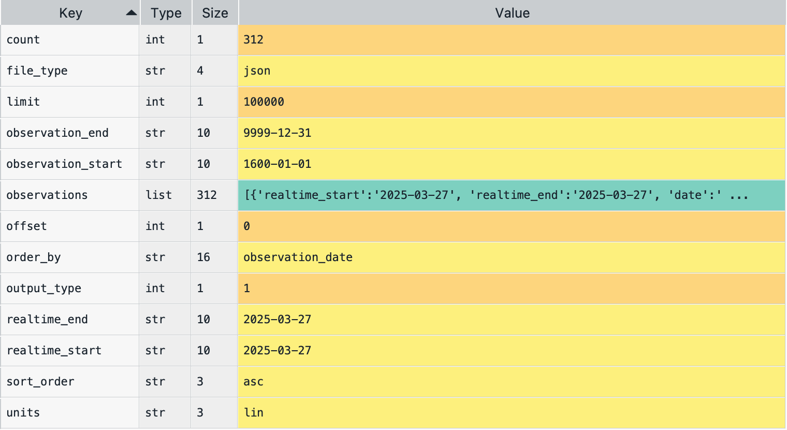

# 📌 Directions

This is an exam on a paper, so minor coding errors are expected. My main focus is on your approach to each question — the logic, algorithms, and syntax you use. Nearly perfect code will be rewarded with bonus credit.

<br>


# Section 2. Data Collection with API (Points: 14)


## Question 1 (Points: 4)

- In the client–server model of the web, which statement is true?
a. A client hosts webpages, and a server displays them to users.
b. A client requests data, and a server responds with data.
c. Clients and servers are the same machine communicating via HTTPS.
d. A server initiates requests, and a client responds with data.


## Question 2 (Points: 10)
- Fill in the following 5 blanks to make a request to the FRED API for collecting the U.S. unemployment rate (`series_id` = "**UNRATE**")

```{python}
#| echo: true
#| eval: false

import requests
import pandas as pd
param_dicts = {
  'api_key': 'YOUR_FRED_API_KEY', ## Change to your own key
  'file_type': 'json',
  'series_id': ___BLANK_1___    ## ID for series data from the FRED
}
api_endpoint = "https://api.stlouisfed.org/fred/series/observations"
response = ___BLANK_2___

# Check if the server successfully sends the requested content
if ___BLANK_3___:
    # Convert JSON response to Python dictionary.
    content = ___BLANK_4___

    # Create a DataFrame of key 'observations's value from the content dictionary
    df = pd.DataFrame( ___BLANK_5___ )
else:
    print("The server cannot find the requested content")
```


**key**-**value** pairs in the `content` dictionary
```{r}
#| eval: true
#| echo: false
#| fig-width: 6
#| fig-align: "center"


```


**_Answer_** for `___BLANK_1___`:

```{python}
#| echo: false
#| eval: false

```


<br>

**_Answer_** for `___BLANK_2___`:

```{python}
#| echo: false
#| eval: false

```


<br>


**_Answer_** for `___BLANK_3___`:

```{python}
#| echo: false
#| eval: false

```


<br>


**_Answer_** for `___BLANK_4___`:

```{python}
#| echo: false
#| eval: false

```


<br>


**_Answer_** for `___BLANK_5___`:

```{python}
#| echo: false
#| eval: false

```


