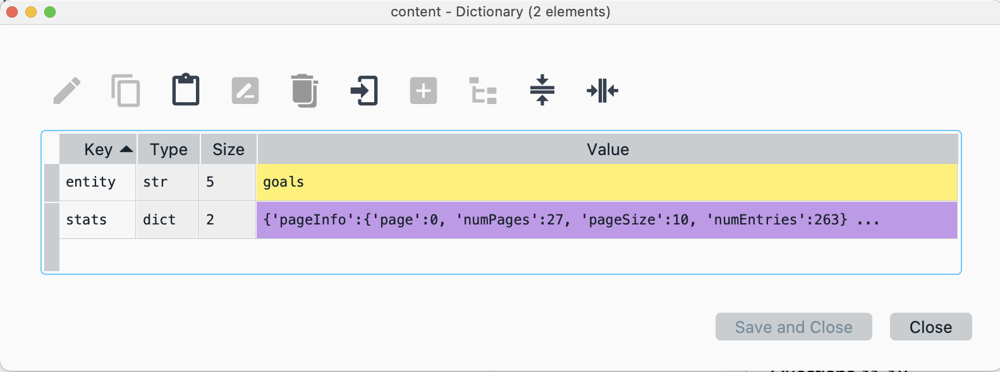
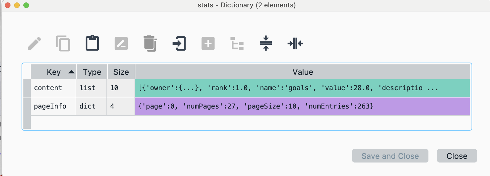
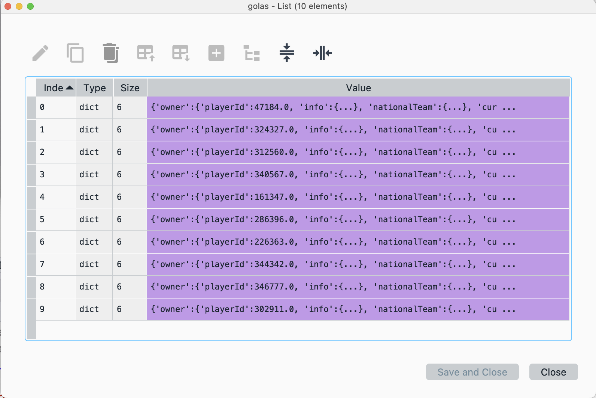
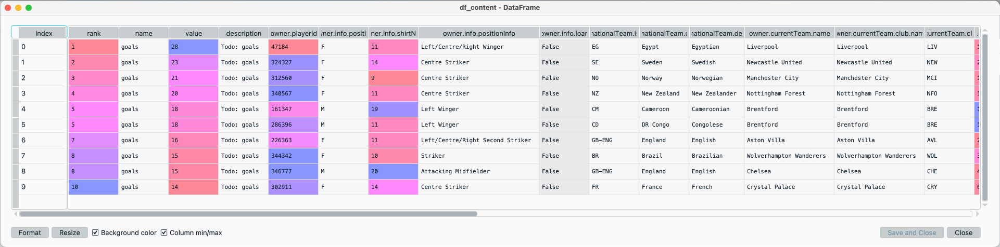
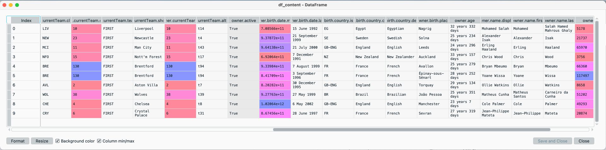
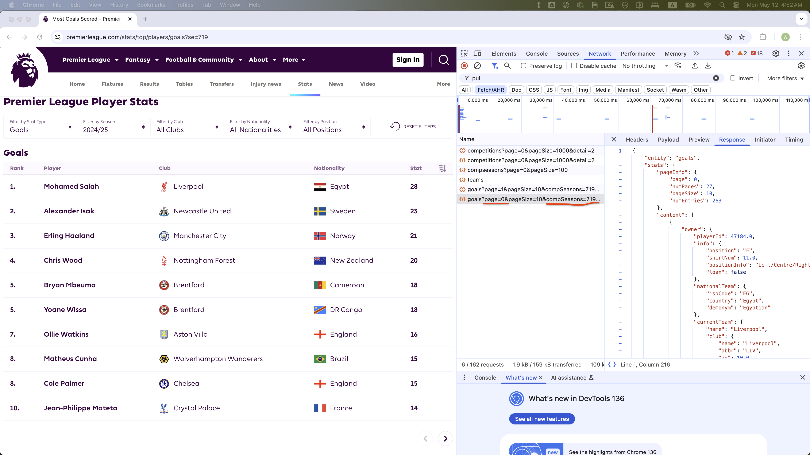
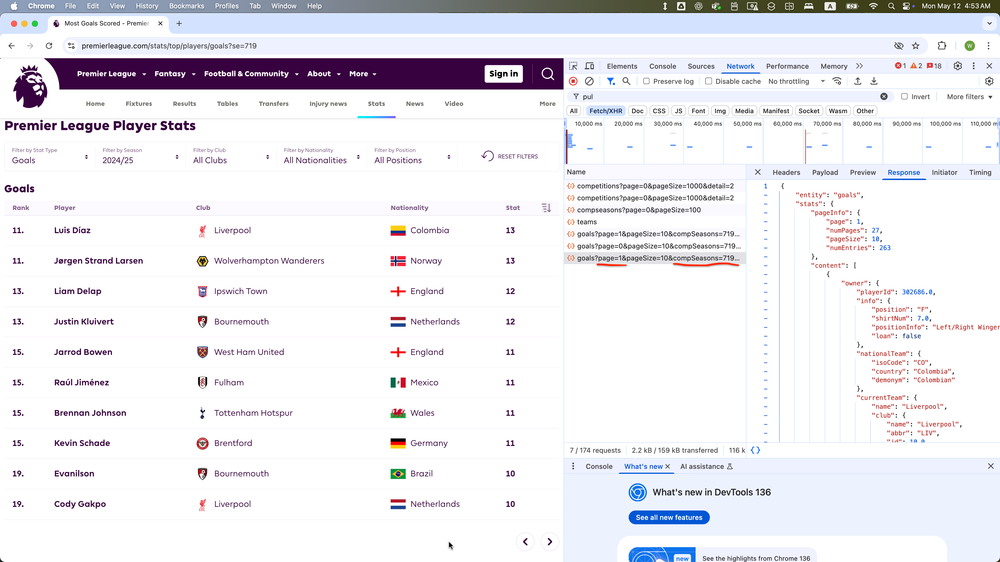
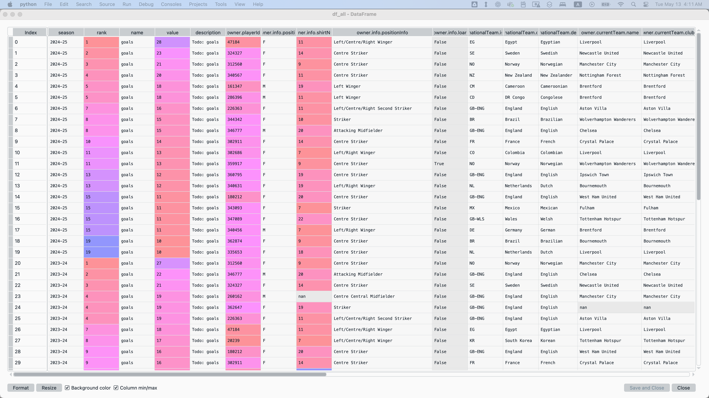

# 📌 Directions

This is an exam on a paper, so minor coding errors are expected. My main focus is on your approach to each question — the logic, algorithms, and syntax you use. Nearly perfect code will be rewarded with bonus credit.

<br>


## Data Collection with APIs (Points: 12)

The code below fetches the Premier League’s top-10 scorers for the 2024–25 season (**compSeasons = 719**) from the Premier League API (which powers the Stats Center at **https://www.premierleague.com/stats/top/players/goals?se=719**):

```{.python}
import requests  
import pandas as pd  
import time
import random 

# Custom headers for browser information
headers = {
    'User-Agent': 'Mozilla/5.0 (Macintosh; Intel Mac OS X 10.15; rv:137.0) Gecko/20100101 Firefox/137.0',
    'Accept': '*/*',
    'Accept-Language': 'en-US,en;q=0.5',
    'Content-Type': 'application/x-www-form-urlencoded; charset=UTF-8',
    'Origin': 'https://www.premierleague.com',
    'Connection': 'keep-alive',
    'Referer': 'https://www.premierleague.com/',
    'Sec-Fetch-Dest': 'empty',
    'Sec-Fetch-Mode': 'cors',
    'Sec-Fetch-Site': 'cross-site',
    'Priority': 'u=0'
}

# Query parameters to paginate and filter the player-goals ranking endpoint
params = {
    'page': '0',                          # which page of results to fetch
    'pageSize': '10',                     # how many records per page
    'compSeasons': '719',                 # season identifier (e.g., 2024–25)
    'comps': '1',                         # competition ID (Premier League)
    'compCodeForActivePlayer': 'EN_PR',   # competition code for active players
    'altIds': 'true',                     # include alternative player IDs
}

# Send GET request to the Premier League stats API
response = requests.get(
    'https://footballapi.pulselive.com/football/stats/ranked/players/goals',
    params=params,
    headers=headers
)

# Parse the JSON response into a Python dict
content = response.json()

# Extract the stats dictionary from the content dictionary
stats = content['stats']

# Extract the list of player records from the stats dictionary
goals = stats['content']

# Convert the list of dicts, golas, into a pandas DataFrame for analysis
df_content = pd.json_normalize(goals)

# Sleep for a random 1–2 second interval.
time.seelp(random.uniform(1,2))

# At this point, df_content contains one row per player-goal record,
# with columns for player identifiers, goal counts, team info, etc.
```


This is the `content` dictionary:

{width="95%"}

This is the `stats` dictionary:

{width="95%"}


This is the `goals` list of dictionaries:




This is the `df_content` DataFrame:






The first page (**page = 0** in the `params`) of the Premier League Player Goals website shows players 1–10:




The second page (**page = 1** in the `params`) of the Premier League Player Goals website shows players 11–20:



 

**Task**:

1.	Use a nested for-loop over:
	-	each `compSeasons` value in `lst_compSeasons = [719, 578, 489]`
	    - `719`, `578`, and `489` correspond to 2024–25, 2023–24, 2022–23 seasons, respectively. 
	-	parameter `page` in `[0, 1]`

2.	In each iteration:
	-	Update the `params` dict with the current `page` and `compSeasons`.
	-	Send the GET request and parse the JSON, as provided in the given code.
	-	Normalize the `content` → `stats` → `goals` list into a DataFrame, as provided in the given code.
	- After each request, pause execution for a random 5–8 second interval. 
	-	Add a column named "**season**" using the matching entry from `lst_compSeasons_txt = ['2024-25', '2023-24', '2022-23']`.
	-	Concatenate the `df_content` DataFrame to one comprehensive DataFrame, `df_all`.

At the end, you should have a single DataFrame with the top 20 scorers for each of the three seasons, including a "**season**" column.


 

This is the `df_all` DataFrame with 60 observations:



**Your Task: Complete the Script Below**

```{.python}
# %%
# =============================================================================
# Setting up
# =============================================================================

import requests  
import pandas as pd  
import time
import random 

# Custom headers for browser information
headers = {
    'User-Agent': 'Mozilla/5.0 (Macintosh; Intel Mac OS X 10.15; rv:137.0) Gecko/20100101 Firefox/137.0',
    'Accept': '*/*',
    'Accept-Language': 'en-US,en;q=0.5',
    'Content-Type': 'application/x-www-form-urlencoded; charset=UTF-8',
    'Origin': 'https://www.premierleague.com',
    'Connection': 'keep-alive',
    'Referer': 'https://www.premierleague.com/',
    'Sec-Fetch-Dest': 'empty',
    'Sec-Fetch-Mode': 'cors',
    'Sec-Fetch-Site': 'cross-site',
    'Priority': 'u=0'
}

# Query parameters to paginate and filter the player-goals ranking endpoint

lst_compSeasons = [719, 578, 489]  # in the order of 2024–25, 2023–24, 2022–23 seasons 
lst_compSeasons_txt = ['2024-25', '2023-24', '2022-23']

_______________PROVIDE_YOUR_CODE_HERE_______________
```


**_Answer_**:

