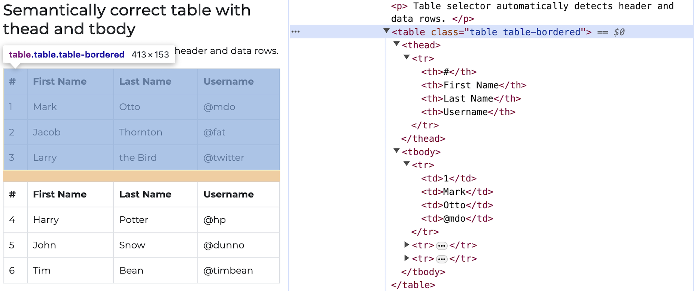

# 📌 Directions

This is an exam on a paper, so minor coding errors are expected. My main focus is on your approach to each question — the logic, algorithms, and syntax you use. Nearly perfect code will be rewarded with bonus credit.

<br>


# Data Collection

```{r}
#| eval: true
#| echo: false

```


```{python}
#| eval: false
#| echo: true

url = 'https://webscraper.io/test-sites/tables/tables-semantically-correct'
```

<br>

## Question 1
- Convert the first table in the above webpage into the DataFrame, `table_0`, using the `pandas` table scrapping method.

<br><br>

## Question 2

- Use selenium to load the webpage.
- Then, scrap the all the data in the first table in the webpage using the `selenium`'s Inspect-`find_element(s)` strategy with `for`-loop.
- Then, export the table data as a CSV file with the file name, **table_0.csv**
