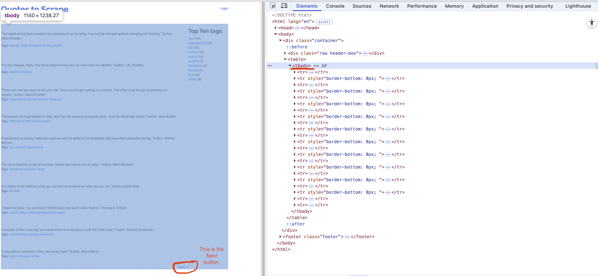
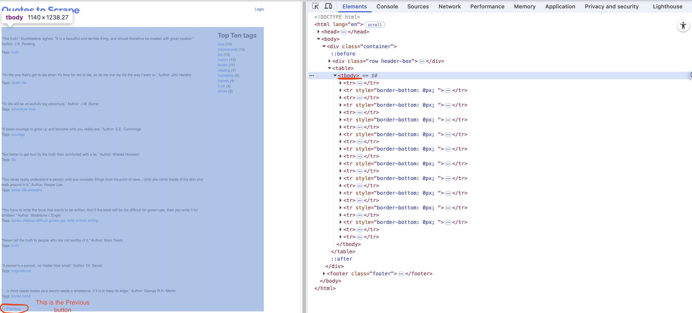
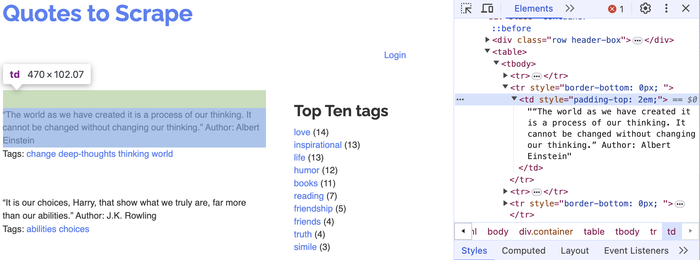
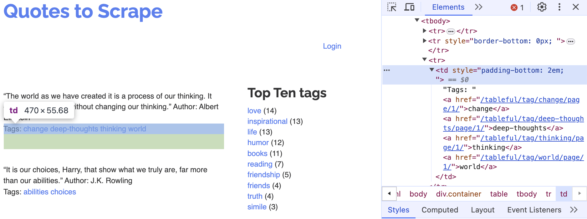

# 📌 Directions

This is an exam on a paper, so minor coding errors are expected. My main focus is on your approach to each question — the logic, algorithms, and syntax you use. Nearly perfect code will be rewarded with bonus credit.

<br>


# Data Collection with Selenium (Points: 36)

```{python}
#| eval: false
#| echo: true
#| warning: false
#| message: false

# %%
# =============================================================================
# Setting up
# =============================================================================
import pandas as pd
import os, time, random
from io import StringIO

# Import the necessary modules from the Selenium library
from selenium import webdriver  # Main module to control the browser
from selenium.webdriver.common.by import By  # Helps locate elements on the webpage
from selenium.webdriver.chrome.options import Options  # Allows setting browser options
from selenium.webdriver.support.ui import WebDriverWait
from selenium.webdriver.support import expected_conditions as EC
from selenium.common.exceptions import NoSuchElementException
from selenium.common.exceptions import TimeoutException
from selenium.common.exceptions import StaleElementReferenceException

# Set the working directory path
wd_path = 'ABSOLUTE_PATHNAME_OF_YOUR_WORKING_DIRECTORY' # e.g., '/Users/bchoe/Documents/DANL-210'
os.chdir(wd_path)  # Change the current working directory to wd_path
os.getcwd()  # Retrieve and return the current working directory

# Create an instance of Chrome options
options = Options()
options.add_argument('--disable-blink-features=AutomationControlled')  # Prevent detection of automation by disabling blink features
options.page_load_strategy = 'eager'  # Load only essential content first, skipping non-critical resources

# Initialize the Chrome WebDriver with the specified options
driver = webdriver.Chrome(options=options)

url = 'http://quotes.toscrape.com/tableful/'

```


**First/Front page** of the website for the `url`:

{width=700px}


**Last page** of the website for the `url`:

{width=700px}


**A single quote with its author**
```{r}
#| eval: true
#| echo: false

```


**Corresponding tags**
```{r}
#| eval: true
#| echo: false

```


## Question 1 (Points: 4)
- Write `pandas` code that reads the HTML table from the front page of the website URL stored in `url` into a DataFrame called `df`.

**_Answer_**:

```{python}
#| echo: false
#| eval: false

df = pd.read_html(url)[0]
```


<br>


## Question 2 (Points: 4)

- Write code to load the first/front page of the website for the `url` on the Chrome browser that *is being controlled by automated test software*, called `selenium`.

**_Answer_**:

```{python}
#| echo: false
#| eval: false

driver.get(url)
```


<br>


## Question 3 (Points: 20)
- Write Python code to scrape every quote from a paginated website (unknown number of pages, 10 quotes per page) by repeatedly clicking the **Next** button until it disappears. 
  - On each page, extract each quote and its author into a column `quote_author` and its associated tags into `tags`, appending them to a DataFrame named `df_clean`. 
  - After loading each page, pause execution for a random 1–2 second interval. 
  - Examine below XPath examples for `quote_author` (rows 2, 4, 6, …) and `tags` (rows 3, 5, 7, …), identify that pattern of even vs. odd row numbers, and use it to build your f-strings for locating each element.

```{python}
#| eval: false
#| echo: true

# Table body - quote with author
xpath_quote_author_01 = '/html/body/div/table/tbody/tr[2]/td'
xpath_quote_author_02 = '/html/body/div/table/tbody/tr[4]/td'
xpath_quote_author_03 = '/html/body/div/table/tbody/tr[6]/td'
xpath_quote_author_04 = '/html/body/div/table/tbody/tr[8]/td'
xpath_quote_author_05 = '/html/body/div/table/tbody/tr[10]/td'
xpath_quote_author_06 = '/html/body/div/table/tbody/tr[12]/td'
xpath_quote_author_07 = '/html/body/div/table/tbody/tr[14]/td'
xpath_quote_author_08 = '/html/body/div/table/tbody/tr[16]/td'
xpath_quote_author_09 = '/html/body/div/table/tbody/tr[18]/td'
xpath_quote_author_10 = '/html/body/div/table/tbody/tr[20]/td'

# Table body - tags
xpath_tags_01 = '/html/body/div/table/tbody/tr[3]/td'
xpath_tags_02 = '/html/body/div/table/tbody/tr[5]/td'
xpath_tags_03 = '/html/body/div/table/tbody/tr[7]/td'
xpath_tags_04 = '/html/body/div/table/tbody/tr[9]/td'
xpath_tags_05 = '/html/body/div/table/tbody/tr[11]/td'
xpath_tags_06 = '/html/body/div/table/tbody/tr[13]/td'
xpath_tags_07 = '/html/body/div/table/tbody/tr[15]/td'
xpath_tags_08 = '/html/body/div/table/tbody/tr[17]/td'
xpath_tags_09 = '/html/body/div/table/tbody/tr[19]/td'
xpath_tags_10 = '/html/body/div/table/tbody/tr[21]/td'
```

**_Answer_**:


```{python}
#| echo: false
#| eval: false
df_clean = pd.DataFrame()
while True:
    
    try:
        btn = driver.find_element(By.PARTIAL_LINK_TEXT, "Next")
    except:
        btn = []

    for i in range(1,11):
        j = i*2
        k = i*2+1
        
        xpath_quote_author = f'/html/body/div/table/tbody/tr[{j}]/td'
        xpath_tags = f'/html/body/div/table/tbody/tr[{k}]/td'
        
        quote_author = driver.find_element(By.XPATH, xpath_quote_author).text
        tags = driver.find_element(By.XPATH, xpath_tags).text
        
        lst = [quote_author, tags]
        obs = pd.DataFrame([lst])
        df_clean = pd.concat([df_clean, obs])
    
    if btn != []:
        btn.click()
        time.sleep(random.uniform(1,2))
    else:
        break
```


<br>

## Question 4 (Points: 4)
- Write one-line code to export the `df_clean` DataFrame as a CSV file named **table_quotes.csv** inside the **data** subfolder of the current working directory given by `wd_path`.
  - Ensure that the CSV does not include row index of the `df_clean` DataFrame.

**_Answer_**:

```{python}
#| echo: false
#| eval: false

df_clean.columns = ['quote_author', 'tags']
df_clean.to_csv('data/quotes_table.csv', index=False, encoding = 'utf-8-sig')  
```

<br>


## Question 5 (Points: 4)

- Write a one-line code to quit the Chrome browser that *is being controlled by automated test software*, called `selenium`.

**_Answer_**:

```{python}
#| echo: false
#| eval: false

```


