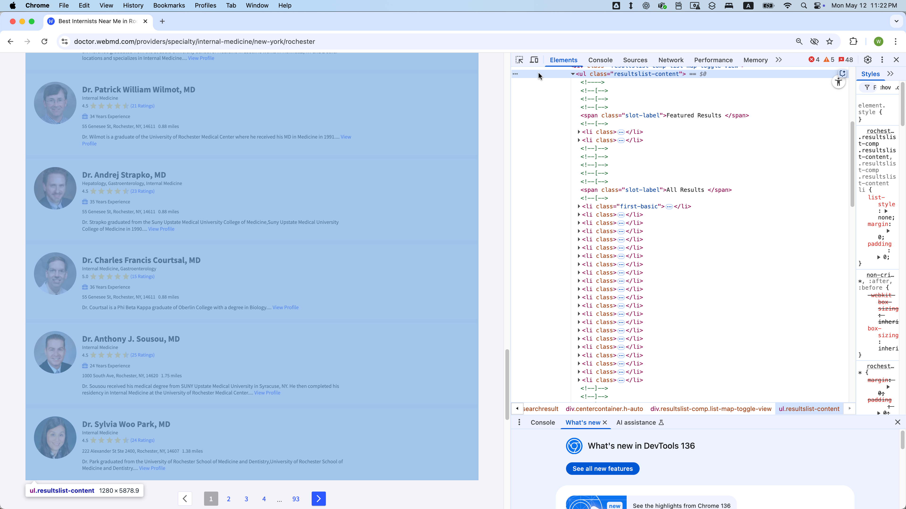
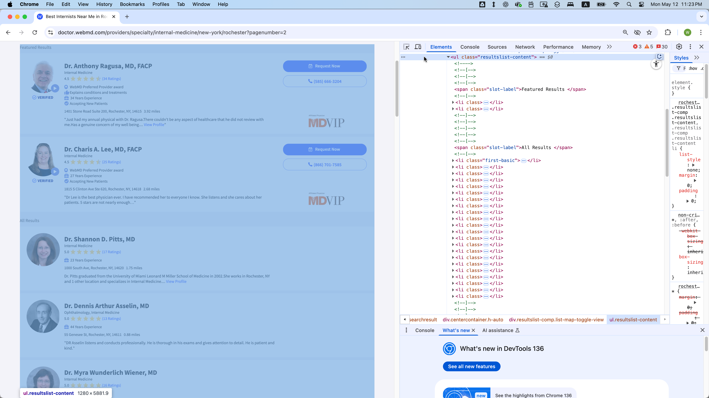
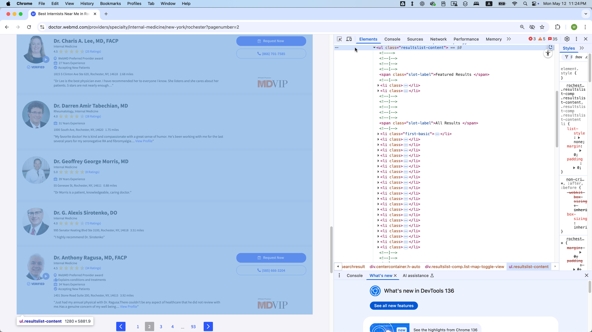
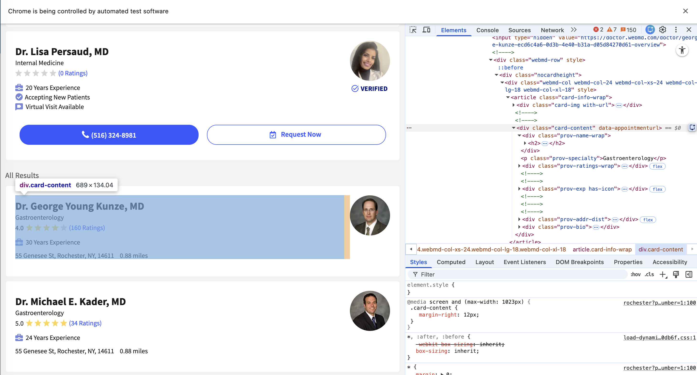
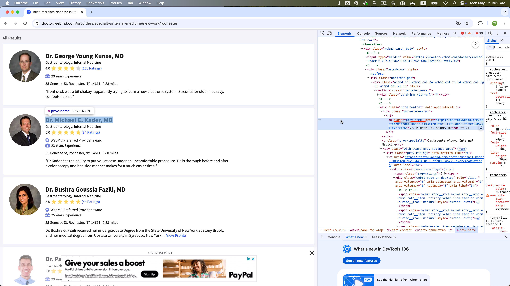
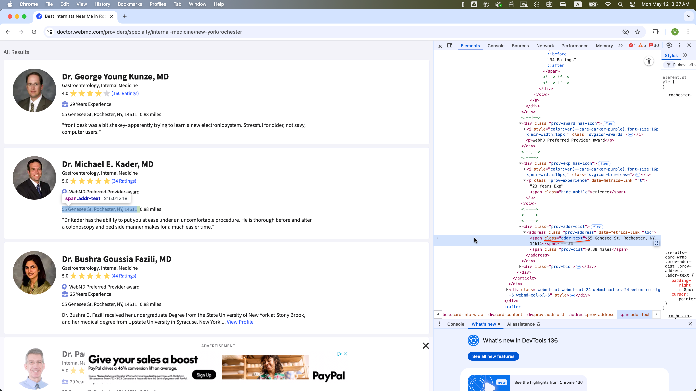
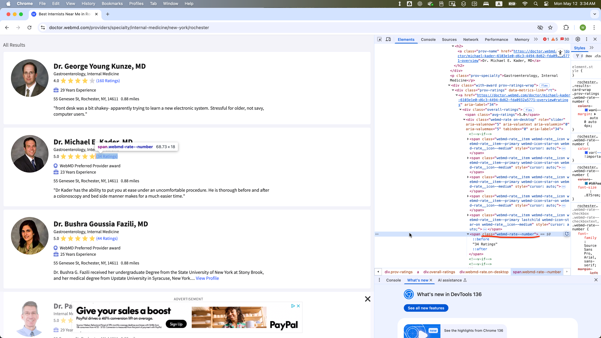
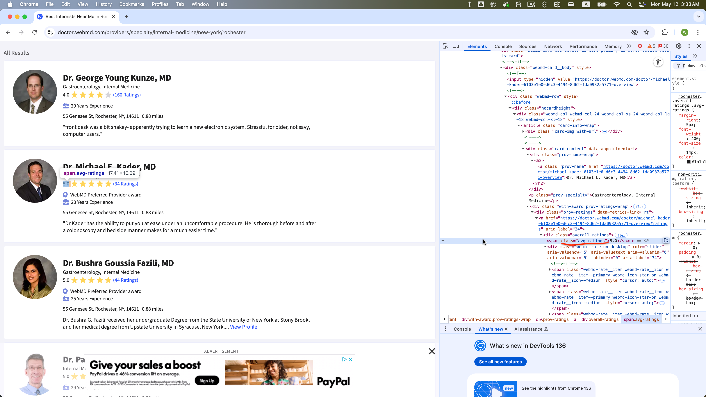
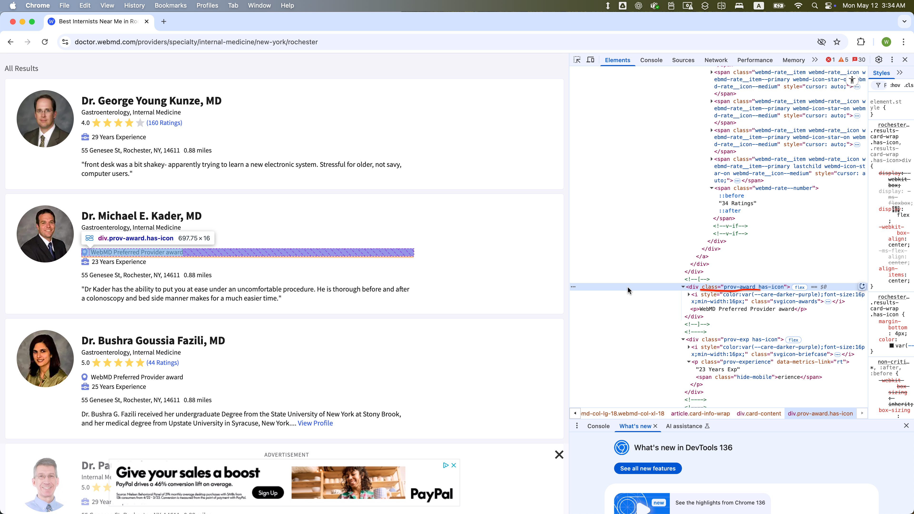
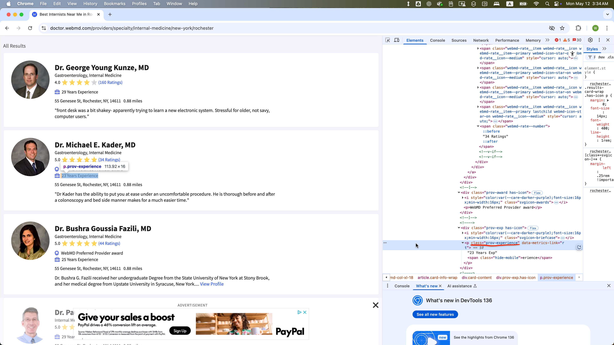

# 📌 Directions

This is an exam on a paper, so minor coding errors are expected. My main focus is on your approach to each question — the logic, algorithms, and syntax you use. Nearly perfect code will be rewarded with bonus credit.

<br>


## Data Collection with Selenium (Points: 24)

You will be collecting data from **WebMD.com** on internal medicine doctors located in **Rochester, NY**:

### Screenshots

Start of the first page

{width="97.5%"}

\pagebreak

End of the first page



\pagebreak

Start of the second page



\pagebreak


End of the second page




\pagebreak


### DOM Structure

Each doctor's information is contained within a `WebElement` with **class = “card-content”**:



- The site contains **35 pages**, with each page accessible via a URL of the form:

<div style="font-size: 0.85em; line-height: 1.25;">
  <ul>
    <li>https://doctor.webmd.com/providers/specialty/internal-medicine/new-york/rochester?pagenumber=1</li>
    <li>https://doctor.webmd.com/providers/specialty/internal-medicine/new-york/rochester?pagenumber=2</li>
    <li>...</li>
    <li>https://doctor.webmd.com/providers/specialty/internal-medicine/new-york/rochester?pagenumber=35</li>
  </ul>
</div>

-	Each page has 68 `WebElement`s with  **class = “card-content”**, except page 35, which may have fewer.
    -	Across all pages (1-35), the **first eight of those 68 `WebElement`s** on each page are *featured results* and should be **excluded** from scraping.
  	-	The **remaining `WebElement`s** represent a **standard listing** and should be **included** in your data collection.
  	

- For each `WebElement` with **class = "card-content"** in the standard listing, these **child elements** are present:
  - **class = "prov-name"** (Doctor’s name)
  - **class = "prov-specialty"** (Specialty)
  - **class = "webmd-rate.on-desktop"** (Number of ratings)

- Some `WebElements` with **class = "card-content"** in the standard listing might also include:
  - **class = "addr-text-dist"**: Parent `WebElements` with **class = "addr-text-dist"** include:
    - **class = "addr-text"** (Address)
  - **class = "avg-ratings"** (Average rating)
  - **class = "prov-award"** (Awards)
  - **class = "prov-experience"** (Years of experience)
  	
-	However, these optional child `WebElement`s (class values with **addr-text**, **avg-ratings**, **prov-experience**, **prov-award**) are not present in some `WebElement`s with **class = "card-content"**


\pagebreak

### `WebElement` Examples

The `WebElement` of **class = "prov-name"** is selected within one `WebElement` with **class = "card-content"**:



\pagebreak


The `WebElement` of **class = "addr-text"** is selected within one `WebElement` with **class = "card-content"**:



\pagebreak

The `WebElement` of **class = "webmd-rate"** is selected within one `WebElement` with **class = "card-content"**:



\pagebreak

The `WebElement` of **class = "avg-ratings"** is selected within one `WebElement` with **class = "card-content"**:



\pagebreak


The `WebElement` of **class = "prov-award"** is selected within one `WebElement` with **class = "card-content"**:



\pagebreak

The `WebElement` of **class = "prov-experience"** is selected within one `WebElement` with **class = "card-content"**:



\pagebreak


### Task:

1. Loop through pages 1 to 35 by constructing the URL with an f-string using the format:
    - `f"{base_url}?pagenumber={page}"`
  
```{.python}
base_url = 'https://doctor.webmd.com/providers/specialty/internal-medicine/new-york/rochester'

# Example URLs
url_1 = f"{base_url}?pagenumber=1"
url_2 = f"{base_url}?pagenumber=2"
...
url_35 = f"{base_url}?pagenumber=35"
```

2.	On each page:
	-	Locate all elements with **class="card-content"**.
	-	Skip the first 16 elements (0-15).
	- Collect information about the providers who are **not** featured.
	-	For each remaining element, extract:
    	-	**name** (**class="prov-name"**)
    	-	**specialty** (**class="prov-specialty"**)
    	-	**address** (**class="addr-text"**)
    	-	**rated_number** (**class="webmd-rate--number"**)
    	-	**avg_rating** (**class="avg-ratings"**, if present)
    	-	**award** (**class="prov-award"**, if present)
    	-	**experience** (**class="prov-experience"**, if present)
3. Concatenate each doctor's data as a row in a pandas DataFrame

4. After loading each page, pause execution for a random 5–8 second interval. 

\pagebreak

**Your Task: Complete the Script Below**

**_Answer_**:


```{.python}
import pandas as pd
import os, time, random
from io import StringIO

# Import the necessary modules from the Selenium library
from selenium import webdriver  # Main module to control the browser
from selenium.webdriver.common.by import By  # Helps locate elements on the webpage
from selenium.webdriver.chrome.options import Options  # Allows setting browser options
from selenium.webdriver.support.ui import WebDriverWait
from selenium.webdriver.support import expected_conditions as EC
from selenium.common.exceptions import NoSuchElementException
from selenium.common.exceptions import TimeoutException
from selenium.common.exceptions import StaleElementReferenceException

# Set the working directory path
wd_path = 'ABSOLUTE_PATHNAME_OF_YOUR_WORKING_DIRECTORY' # e.g., '/Users/bchoe/Documents/DANL-210'
os.chdir(wd_path)  # Change the current working directory to wd_path
os.getcwd()  # Retrieve and return the current working directory

# Create an instance of Chrome options
options = Options()
options.add_argument('--disable-blink-features=AutomationControlled')  # Prevent detection of automation by disabling blink features
options.page_load_strategy = 'eager'  # Load only essential content first, skipping non-critical resources

# Initialize the Chrome WebDriver with the specified options
driver = webdriver.Chrome(options=options)

_______________PROVIDE_YOUR_CODE_FROM_HERE_______________
```


**_Answer_**:
