```{r setup}
#| include: false
#| eval: true

library(knitr)
library(tidyverse)
# set default options
opts_chunk$set(echo = FALSE,
               fig.width = 7.252,
               fig.height = 4,
               comment = "#",
               dpi = 300)

knitr::knit_engines$set("markdown")
```


---
class: inverse, center, middle

# Prologue
<html><div style='float:left'></div><hr color='#EB811B' size=1px width=796px></html>

---
# Why Data Analytics

Fill in the gaps left by traditional business and economics classes.

- Practical skills that will benefit your future career.
- Neglected skills like how to actually find datasets in the wild and clean them.

--

Data analytics skills are largely distinct from (and complementary to) the core quantitative works familiar to business undergrads.

- Data visualization, cleaning and wrangling; databases; machine learning; etc.

--

> *"In short, we will cover things that I wish someone had taught me when I was 
undergraduate."*

---

# You, at the end of this course

```{r, echo=FALSE, eval = T, out.width = '72.5%', fig.align='center'}
knitr::include_graphics("lec_figs/yes-that-s-awesome.jpeg")
```


---
class: inverse, center, middle

# Prologue
<html><div style='float:left'></div><hr color='#EB811B' size=1px width=796px></html>


---
# Lecture Outline
.pull-left[
- Introduction
  - Motivation
  - Trends in data analytics


- Data collection
  - Web-scraping 
]

--

.pull-right[

- Data visualization
  - Fundamentals
  - Data cleaning
  - Distribution plots
  - Scatter plots
  - Heat-maps
  - Maps
  


]


---
# Why Data Analytics?
### <p style="color:#00449E">  </p>

**Data analysts** use analytical tools and techniques to extract meaningful insights from data.
  - Skills in data analytics are also useful for **business analysts** or **market analysts**.


--

[Breau of Labor Statistics](https://www.bls.gov/ooh/math/data-scientists.htm) forecasts that the projected growth rate of the employment in the industry related to data analytics from 2021 to 2031 is **36%**. 
  - The average growth rate for all occupations is **5%**.


---
# Why Python, R, and Databases?
### <p style="color:#00449E">  </p>

```{r, echo=F, eval = T, out.width='80%'}
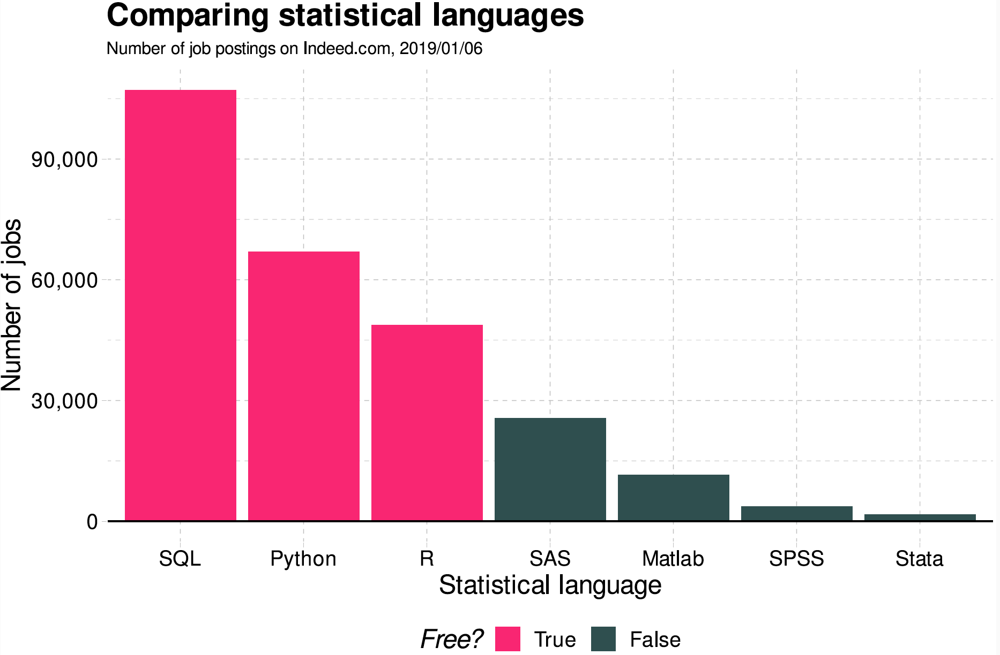
```

---
# Why Python, R, and Databases? (cont.)
### <p style="color:#00449E"> Stack Overflow Trends </p>

See how programming languages have trended over time based on use of their tags in Stack Overflow since 2008.

.pull-left[
### <p style="color:#00449E"> Most Popular Languagues </p>
```{r, echo=F, eval = T, out.width='100%'}
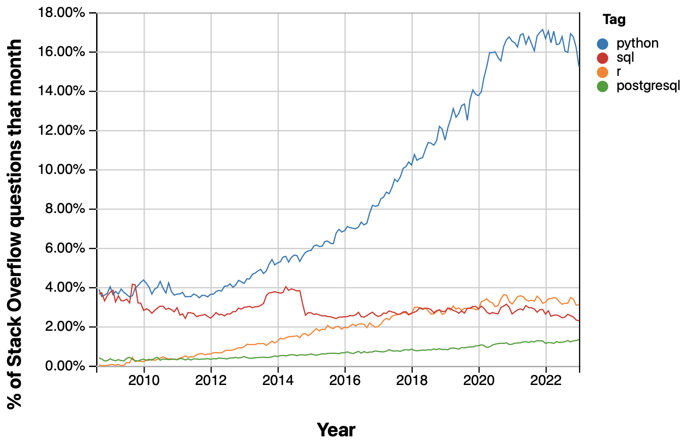
```
]

--

.pull-right[
### <p style="color:#00449E"> Data Science and Big Data </p>
```{r, echo=F, eval = T, out.width='100%'}
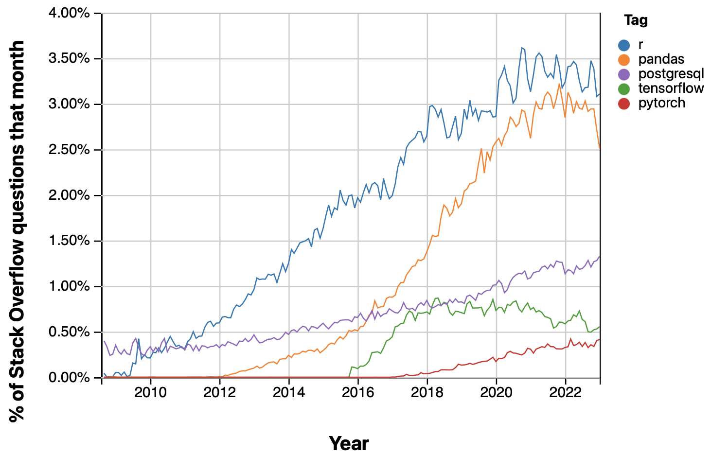
```
]


---
# The State of the Art
### <p style="color:#00449E"> ChatGPT and AI </p>


.pull-left[
Programmers in 2023

```{r, echo=F, eval = T, out.width='100%'}

```
]


--

.pull-right[
- Users around the world have explored for using GPT for writing essays and programming codes.
]


---
# The State of the Art
### <p style="color:#00449E"> ChatGPT and AI </p>


.pull-left[
Programmers in 2023

```{r, echo=F, eval = T, out.width='100%'}

```
]


.pull-right[
- Users around the world have explored for using GPT for writing essays and programming codes.

- Is AI a threat to data analytics?
  - Fundamental understanding of the subject matter is still crucial for effectively utilizing its capabilities.
]


---
class: inverse, center, middle

# Data Collection with Webscrapping
<html><div style='float:left'></div><hr color='#EB811B' size=1px width=796px></html>


---
# Webscrapping
### <p style="color:#00449E"> Ethical Considerations </p>

> *"If you can see things in your web browser, you can scrape 
them."*

--

Just because you can scrape them, doesn't mean you should.


It is currently legal to scrape data from the web using **automated** tools, as long as the data are **publicly available**.
  - [hiQ Labs vs. LinkedIn Corp. court ruling](https://en.wikipedia.org/wiki/HiQ_Labs_v._LinkedIn).


--


Be cautious! Web scrapping tools are extremely powerful!
  - It is pretty easy to write up a program that can overwhelm a host server.
  - The host server tends to have built-in safeguards that will block you in case of a suspected malicious attack.


---
# Webscrapping
### <p style="color:#00449E"> Clients and Servers </p>

Computers connected to the web are called **clients** and **servers**.


```{r, echo=FALSE, eval = T, out.width = '32.5%', fig.align='center'}
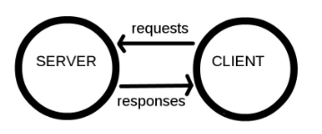
```

--

**Clients** are the typical web user’s internet-connected devices (e.g., a computer connected to Wi-Fi) with web-browsers (e.g., Firefox, Chrome).


**Servers** are computers that store webpages, sites, or apps.

--

  - When a client device wants to access a webpage, **a copy of the webpage is downloaded from the server onto the client machine** to be displayed in the user’s web browser.


---
# Webscrapping
### <p style="color:#00449E"> Hyper Text Markup Language (HTML) </p>

.pull-left[

```{r, echo=FALSE, eval = T, out.width = '75%', fig.align='center'}
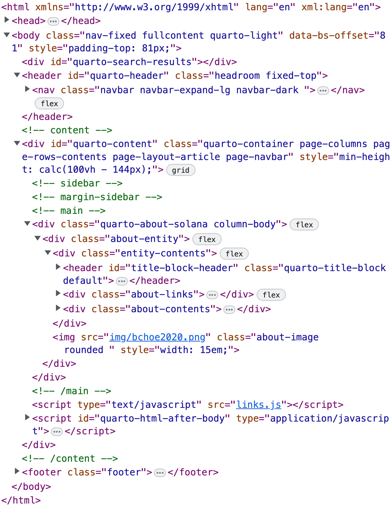
```

]

--

.pull-right[

```{r, echo=FALSE, eval = T, out.width = '75%', fig.align='center'}

```


]


---
# Webscrapping
### <p style="color:#00449E"> WebDriver and Driver </p>

.pull-left[

```{r, echo=FALSE, eval = T, out.width = '100%', fig.align='center'}
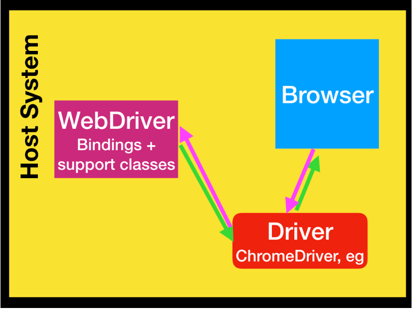
```

]

.pull-right[
- **WebDriver** is an wire protocol that controls the behavior of a web browser.

- **Driver** handles communications between **WebDriver** and a web browser.

]


---
# Webscrapping
### <p style="color:#00449E"> WebDriver and Driver </p>

.pull-left[

```{r, echo=FALSE, eval = T, out.width = '100%', fig.align='center'}

```

]


.pull-right[
- **WebDriver** is an wire protocol that controls the behavior of a web browser.


- **Driver** handles communications between **WebDriver** and a web browser.


- We can use programming to join this communication.

]

---
# Webscrapping
### <p style="color:#00449E"> WebDriver and Driver </p>

.pull-left[

```{r, echo=FALSE, eval = T, out.width = '100%', fig.align='center'}

```

]


.pull-right[
- **WebDriver** is an wire protocol that controls the behavior of a web browser.


- **Driver** handles communications between **WebDriver** and a web browser.


- We can use programming to join this communication.
  - Automating the use of keyboards and mouses! `r emoji('roll_eyes')`
]


---
class: inverse, center, middle
# Webscrapping
### <p style="color:#00449E">  </p>

Let's scrape all the quotes in [http://quotes.toscrape.com](http://quotes.toscrape.com)!


---
# Webscrapping
### <p style="color:#00449E">  </p>

### Prepare the required softwares

- [Download](https://chromedriver.chromium.org/downloads) the `ChromeDriver` file that is compatible with your Chrome Browser. 

- Install the Python library, `selenium`:
  - On Terminal, type `pip install selenium`.


---
# Webscrapping
### <p style="color:#00449E">  </p>

Here is the step-by-step Python code with the `selenium` library.

### Step 1. Load `pandas` and `selenium` libraries.

```{python}
# Import the pandas library
import pandas as pd

# Import the webdriver module and the By class from the selenium library
from selenium import webdriver
from selenium.webdriver.common.by import By
```


---
# Webscrapping
### <p style="color:#00449E">  </p>

Here is the step-by-step Python code with the `selenium` library.

### Step 2. Create a new webdriver object using `webdriver.Chrome()`

```{python}
driver = webdriver.Chrome(
# Set the `options` parameter 
  # to None to use the default options for Chrome
  chrome_options = None, 
  
# Set the `executable_path` parameter 
  # to the path name of ChromeDriver in a local hard disk drive
  executable_path = "PATH_NAME_OF_ChromeDriver"
  )

```


---
# Webscrapping
### <p style="color:#00449E">  </p>

Here is the step-by-step Python code with the `selenium` library.

### Step 2. Create a new webdriver object using `webdriver.Chrome()`

```{python}
*driver = webdriver.Chrome(
# Set the `options` parameter 
  # to None to use the default options for Chrome
  chrome_options = None, 
  
# Set the `executable_path` parameter 
  # to the path name of ChromeDriver in a local hard disk drive
  executable_path = "PATH_NAME_OF_ChromeDriver"
  )

```


---
# Webscrapping
### <p style="color:#00449E">  </p>

Here is the step-by-step Python code with the `selenium` library.

### Step 2. Create a new webdriver object using `webdriver.Chrome()`


```{python}
driver = webdriver.Chrome(
# Set the `options` parameter 
  # to None to use the default options for Chrome
  chrome_options = None, 
  
# Set the `executable_path` parameter 
  # to the path name of ChromeDriver in a local hard disk drive
*  executable_path = "PATH_NAME_OF_ChromeDriver"
  )

```

- Need to copy and paste the path name of `ChromeDriver` in your local hard disk drive.


---
# Webscrapping
### <p style="color:#00449E">  </p>

Here is the step-by-step Python code with the `selenium` library.

### Step 3. Use the `.get()` method to get to the website.

```{python}
# Navigate to the URL using the get() method of the webdriver 
URL = "http://quotes.toscrape.com/"
driver.get(URL)
```

---
# Webscrapping
### <p style="color:#00449E">  </p>

Here is the step-by-step Python code with the `selenium` library.

### Step 4. Loop over finding web elements.

```{python}
# Create an empty pandas DataFrame to store data from the loop
df = pd.DataFrame()
# Loop indefinitely until the break statement is executed at the end
while True:
    # Find all elements on the page with the class name 'text' 
    # and store them in a list
    quotes = driver.find_elements(By.CLASS_NAME, 'text')

    # Find all elements on the page with the class name 'author' 
    # and store them in a list
    authors = driver.find_elements(By.CLASS_NAME, 'author')
```


---
# Webscrapping
### <p style="color:#00449E">  </p>

Here is the step-by-step Python code with the `selenium` library.

### Step 4. Loop over finding web elements.

```{python}
*# Create an empty pandas DataFrame to store data from the loop
*df = pd.DataFrame()
# Loop indefinitely until the break statement is executed at the end
while True:
    # Find all elements on the page with the class name 'text' 
    # and store them in a list
    quotes = driver.find_elements(By.CLASS_NAME, 'text')

    # Find all elements on the page with the class name 'author' 
    # and store them in a list
    authors = driver.find_elements(By.CLASS_NAME, 'author')
```


---
# Webscrapping
### <p style="color:#00449E">  </p>

Here is the step-by-step Python code with the `selenium` library.

### Step 4. Loop over finding web elements.

```{python}
# Create an empty pandas DataFrame to store data from the loop
df = pd.DataFrame()
*# Loop indefinitely until the break statement is executed at the end
*while True:
    # Find all elements on the page with the class name 'text' 
    # and store them in a list
    quotes = driver.find_elements(By.CLASS_NAME, 'text')

    # Find all elements on the page with the class name 'author' 
    # and store them in a list
    authors = driver.find_elements(By.CLASS_NAME, 'author')
```


---
# Webscrapping
### <p style="color:#00449E">  </p>

Here is the step-by-step Python code with the `selenium` library.

### Step 4. Loop over finding web elements.

```{python}
# Create an empty pandas DataFrame to store data from the loop
df = pd.DataFrame()
# Loop indefinitely until the break statement is executed at the end
while True:
*    # Find all elements on the page with the class name 'text' 
*    # and store them in a list
*    quotes = driver.find_elements(By.CLASS_NAME, 'text')

    # Find all elements on the page with the class name 'author' 
    # and store them in a list
    authors = driver.find_elements(By.CLASS_NAME, 'author')
```


---
# Webscrapping
### <p style="color:#00449E">  </p>

Here is the step-by-step Python code with the `selenium` library.

### Step 4. Loop over finding web elements.

```{python}
# Create an empty pandas DataFrame to store data from the loop
df = pd.DataFrame()
# Loop indefinitely until the break statement is executed at the end
while True:
    # Find all elements on the page with the class name 'text' 
    # and store them in a list
    quotes = driver.find_elements(By.CLASS_NAME, 'text')

*    # Find all elements on the page with the class name 'author' 
*    # and store them in a list
*    authors = driver.find_elements(By.CLASS_NAME, 'author')
```


---
# Webscrapping
### <p style="color:#00449E">  </p>

Here is the step-by-step Python code with the `selenium` library.

### Step 4. Loop over finding web elements. (cont.)


```{python}
*    # Find all elements on the page with the class name 'tags' 
*    # and store them in a list
*    tags = driver.find_elements(By.CLASS_NAME, 'tags')

    # Find all elements on the page with the link text '(about)' 
    # and store them in a list
    abouts = driver.find_elements(By.LINK_TEXT, '(about)')

    # Find all elements on the page with the partial link text 'Next' 
    # and store them in a list
    next_btn = driver.find_elements(By.PARTIAL_LINK_TEXT, 'Next')
```


---
# Webscrapping
### <p style="color:#00449E">  </p>

Here is the step-by-step Python code with the `selenium` library.

### Step 4. Loop over finding web elements. (cont.)


```{python}
    # Find all elements on the page with the class name 'tags' 
    # and store them in a list
    tags = driver.find_elements(By.CLASS_NAME, 'tags')

*    # Find all elements on the page with the link text '(about)' 
*    # and store them in a list
*    abouts = driver.find_elements(By.LINK_TEXT, '(about)')

    # Find all elements on the page with the partial link text 'Next' 
    # and store them in a list
    next_btn = driver.find_elements(By.PARTIAL_LINK_TEXT, 'Next')
```


---
# Webscrapping
### <p style="color:#00449E">  </p>

Here is the step-by-step Python code with the `selenium` library.

### Step 4. Loop over finding web elements. (cont.)


```{python}
    # Find all elements on the page with the class name 'tags' 
    # and store them in a list
    tags = driver.find_elements(By.CLASS_NAME, 'tags')

    # Find all elements on the page with the link text '(about)' 
    # and store them in a list
    abouts = driver.find_elements(By.LINK_TEXT, '(about)')

*    # Find all elements on the page with the partial link text 'Next' 
*    # and store them in a list
*    next_btn = driver.find_elements(By.PARTIAL_LINK_TEXT, 'Next')
```


---
# Webscrapping
### <p style="color:#00449E">  </p>

Here is the step-by-step Python code with the `selenium` library.

### Step 4. Loop over finding web elements. (cont.)

```{python}
*    # Loop through each quote on the page (10 quotes per page)
*    for j in range(0, len(quotes)):
        # Create a new DataFrame with the scrapped objects
        quote = pd.DataFrame([quotes[j].text])
        author = pd.DataFrame([authors[j].text])
        tag = pd.DataFrame([tags[j].text])
        about = pd.DataFrame([abouts[j].get_attribute('href')])
        data = pd.concat([quote, author, tag, about], axis=1)
        df = df.append(data)
```


---
# Webscrapping
### <p style="color:#00449E">  </p>

Here is the step-by-step Python code with the `selenium` library.

### Step 4. Loop over finding web elements. (cont.)

```{python}
    # Loop through each quote on the page
    for j in range(0, len(quotes)):
*        # Create a new DataFrame with the scrapped objects
*        quote = pd.DataFrame([quotes[j].text])
*        author = pd.DataFrame([authors[j].text])
*        tag = pd.DataFrame([tags[j].text])
*        about = pd.DataFrame([abouts[j].get_attribute('href')])
        data = pd.concat([quote, author, tag, about], axis=1)
        df = df.append(data)
```


---
# Webscrapping
### <p style="color:#00449E">  </p>

Here is the step-by-step Python code with the `selenium` library.

### Step 4. Loop over finding web elements. (cont.)

```{python}
    # Loop through each quote on the page
    for j in range(0, len(quotes)):
        # Create a new DataFrame with the scrapped objects
        quote = pd.DataFrame([quotes[j].text])
        author = pd.DataFrame([authors[j].text])
        tag = pd.DataFrame([tags[j].text])
        about = pd.DataFrame([abouts[j].get_attribute('href')])
*       data = pd.concat([quote, author, tag, about], axis=1) # all-in-one
*       df = df.append(data)            # to add a new row to df DataFrame
```


---
# Webscrapping
### <p style="color:#00449E">  </p>

Here is the step-by-step Python code with the `selenium` library.

### Step 4. Loop over finding web elements. 

```{python}
*    # Check if a next button is present
*    if next_btn != []:
*        # Click the next button to navigate to the next page of quotes
*        next_btn[0].click()
    else:
        # Exit the While-loop if no next button is present
        break
```


---
# Webscrapping
### <p style="color:#00449E">  </p>

Here is the step-by-step Python code with the `selenium` library.

### Step 4. Loop over finding web elements. (End of the `While`-loop)

```{python}
    # Check if a next button is present
    if next_btn != []:
        # Click the next button to navigate to the next page of quotes
        next_btn[0].click()
*    else:
*        # Exit the While-loop if no next button is present
*        break
```


---
# Webscrapping
### <p style="color:#00449E">  </p>

Here is the step-by-step Python code with the `selenium` library.

### Step 5. Export the DataFrame to the CSV/Excel file.

```{python}
# Rename the columns of the DataFrame
df.columns = ['quote', 'author', 'tag', 'about']

# Write the DataFrame to a CSV file at the specified path
df.to_csv("PATH_NAME_TO_STORE_DATAFRAME_FOR_QUOTES.csv")
```


---
class: inverse, center, middle

# Data Exploration
<html><div style='float:left'></div><hr color='#EB811B' size=1px width=796px></html>


---
# Beer Markets

The `beer_mkt` data.frame has 73,115 observations of beer purchases in the US. 

These observations are taken from the *Nielsen Home-Scan database*.

```{r, echo = F, eval = T, message=F, warning=F}
rmarkdown::paged_table(beer_mkt %>% 
                         select(hh, market, brand, beer_floz, price_per_floz, spent, promo, everything()) %>% arrange(hh, brand), options = list(rows.print = 10) )
```


---
class: inverse, center, middle
# Beer Markets
### <p style="color:#00449E">  </p>

**Q**. How does the volume of beer and the price of beer varies by brand?


---
# Beer Markets
### <p style="color:#00449E">  </p>

We can use the summary statistics grouped by `brand`.

--

```{r}
# A good way to pronounce %>% is “then”.

# Takes the `beer_mkt` data frame as input
beer_mkt %>% 
  
  # Groups the data by the `brand` variable
  group_by(brand) %>% 
  
  # Generates summary statistics 
  # for the `beer_floz` and `price_per_floz * 12` variables 
  # in the grouped data
  skim(beer_floz, price_per_floz * 12) 

```


---
# Beer Markets
### <p style="color:#00449E">  </p>

We can use the summary statistics grouped by `brand`.

```{r}
# A good way to pronounce %>% is “then”.

# Takes the `beer_mkt` data frame as input
beer_mkt %>% 
  
*  # Groups the data by the `brand` variable
*  group_by(brand) %>% 
  
* # Generates summary statistics 
  # for the `beer_floz` and `price_per_floz * 12` variables 
  # in the grouped data
*  skim(beer_floz, price_per_floz * 12) 

```


---
# Beer Markets
### <p style="color:#00449E"> Grouped Summary  </p>


```{r, eval=T, echo=F, message=F, warning=F}
sum <- beer_mkt %>% 
  mutate(price_per_floz = 12 * price_per_floz) %>% 
  rename(price_per_12oz = price_per_floz) %>% 
  group_by(brand) %>% 
  skim(beer_floz, price_per_12oz) %>% 
  select(skim_variable, brand, numeric.mean, numeric.sd, 
         numeric.p0, numeric.p25, numeric.p50, numeric.p75, numeric.p100) %>% 
  rename(Variable = skim_variable, Brand = brand, Mean = numeric.mean, Std.Dev. = numeric.sd, 
         Min = numeric.p0, Q1 = numeric.p25, Median = numeric.p50, Q3 = numeric.p75, Max =numeric.p100) %>% arrange(Variable, Brand) %>% 
  mutate( Mean = round(Mean, 2),
          Std.Dev. = round(Std.Dev., 2),
          Min = round(Min, 2),
          Q1 = round(Q1, 2),
          Median = round(Median, 2),
          Q3 = round(Q3, 2),
          Max = round(Max, 2)
          ) %>% 
  select(Brand, everything())
rmarkdown::paged_table(sum)

```


---
class: inverse, center, middle

# Data Visualization 
<html><div style='float:left'></div><hr color='#EB811B' size=1px width=796px></html>


---
# The Layered Grammar of Graphics

When visualizing data, we take data values and convert them in a **systematic** and **logical** way into the visual elements.


--

- The seven components in the template compose the **grammar of graphics**, a formal system for building a data visualization.


.pull-left[
```{r, echo = T, eval = F}
ggplot(data = <DATA>,
       mapping = aes(<MAPPINGS>))+ 
  <GEOM_FUNCTION>() +
  <FACET_FUNCTION>() +
  <COORDINATE_FUNCTION> +
  <SCALE> +
  <THEME>
```
]

.pull-right[

<!-- compose the **grammar of graphics**.  -->
]


---
# The Layered Grammar of Graphics

When visualizing data, we take data values and convert them in a **systematic** and **logical** way into the visual elements.


- The seven components in the template compose the **grammar of graphics**, a formal system for building a data visualization.


.pull-left[
```{r, echo = T, eval = F}
*ggplot(data = <DATA>,
       mapping = aes(<MAPPINGS>))+ 
  <GEOM_FUNCTION>() +
  <FACET_FUNCTION>() +
  <COORDINATE_FUNCTION> +
  <SCALE> +
  <THEME>
```
]

.pull-right[
1. Data

<!-- compose the **grammar of graphics**.  -->
]


---
# The Layered Grammar of Graphics

When visualizing data, we take data values and convert them in a **systematic** and **logical** way into the visual elements.


- The seven components in the template compose the **grammar of graphics**, a formal system for building a data visualization.


.pull-left[
```{r, echo = T, eval = F}
ggplot(data = <DATA>,
*       mapping = aes(<MAPPINGS>))+ 
  <GEOM_FUNCTION>() +
  <FACET_FUNCTION>() +
  <COORDINATE_FUNCTION> +
  <SCALE> +
  <THEME>
```
]

.pull-right[
1. Data
2. Aesthetic mappings

<!-- compose the **grammar of graphics**.  -->
]


---
# The Layered Grammar of Graphics

When visualizing data, we take data values and convert them in a **systematic** and **logical** way into the visual elements.


- The seven components in the template compose the **grammar of graphics**, a formal system for building a data visualization.


.pull-left[
```{r, echo = T, eval = F}
ggplot(data = <DATA>,
       mapping = aes(<MAPPINGS>))+ 
*  <GEOM_FUNCTION>() +
  <FACET_FUNCTION>() +
  <COORDINATE_FUNCTION> +
  <SCALE> +
  <THEME>
```
]

.pull-right[
1. Data
2. Aesthetic mappings
3. Geometric objects

<!-- compose the **grammar of graphics**.  -->
]


---
# The Layered Grammar of Graphics

When visualizing data, we take data values and convert them in a **systematic** and **logical** way into the visual elements.


- The seven components in the template compose the **grammar of graphics**, a formal system for building a data visualization.


.pull-left[
```{r, echo = T, eval = F}
ggplot(data = <DATA>,
       mapping = aes(<MAPPINGS>))+ 
  <GEOM_FUNCTION>() +
*  <FACET_FUNCTION>() +
  <COORDINATE_FUNCTION> +
  <SCALE> +
  <THEME>
```
]

.pull-right[
1. Data
2. Aesthetic mappings
3. Geometric objects
4. Facets

<!-- compose the **grammar of graphics**.  -->
]


---
# The Layered Grammar of Graphics

When visualizing data, we take data values and convert them in a **systematic** and **logical** way into the visual elements.


- The seven components in the template compose the **grammar of graphics**, a formal system for building a data visualization.


.pull-left[
```{r, echo = T, eval = F}
ggplot(data = <DATA>,
       mapping = aes(<MAPPINGS>))+ 
  <GEOM_FUNCTION>() +
  <FACET_FUNCTION>() +
*  <COORDINATE_FUNCTION> +
  <SCALE> +
  <THEME>
```
]

.pull-right[
1. Data
2. Aesthetic mappings
3. Geometric objects
4. Facets
5. Coordinates

<!-- compose the **grammar of graphics**.  -->
]


---
# The Layered Grammar of Graphics

When visualizing data, we take data values and convert them in a **systematic** and **logical** way into the visual elements.


- The seven components in the template compose the **grammar of graphics**, a formal system for building a data visualization.


.pull-left[
```{r, echo = T, eval = F}
ggplot(data = <DATA>,
       mapping = aes(<MAPPINGS>))+ 
  <GEOM_FUNCTION>() +
  <FACET_FUNCTION>() +
  <COORDINATE_FUNCTION> +
*  <SCALE> +
  <THEME>
```
]

.pull-right[
1. Data
2. Aesthetic mappings
3. Geometric objects
4. Facets
5. Coordinates
6. Scales

<!-- compose the **grammar of graphics**.  -->
]


---
# The Layered Grammar of Graphics

When visualizing data, we take data values and convert them in a **systematic** and **logical** way into the visual elements.


- The seven components in the template compose the **grammar of graphics**, a formal system for building a data visualization.


.pull-left[
```{r, echo = T, eval = F}
ggplot(data = <DATA>,
       mapping = aes(<MAPPINGS>))+ 
  <GEOM_FUNCTION>() +
  <FACET_FUNCTION>() +
  <COORDINATE_FUNCTION> +
  <SCALE> +
*  <THEME>
```
]

.pull-right[
1. Data
2. Aesthetic mappings
3. Geometric objects
4. Facets
5. Coordinates
6. Scales
7. Themes

<!-- compose the **grammar of graphics**.  -->
]

---
# The Layered Grammar of Graphics
### <p style="color:#00449E"> Visualization Workflow </p>

```{r, echo=FALSE, eval = T, out.width = '100%', fig.align='center'}
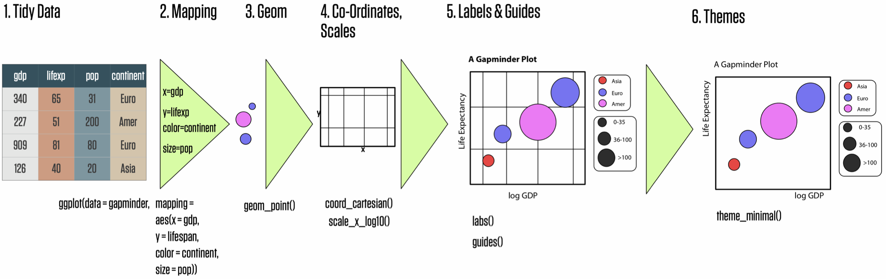
```
  

---
# The Layered Grammar of Graphics
### <p style="color:#00449E"> Visualization Workflow </p>

```{r, echo=FALSE, eval = T, out.width = '100%', fig.align='center'}
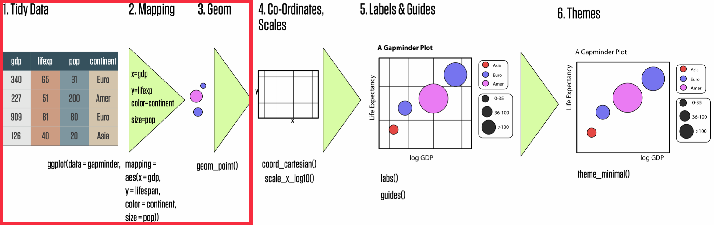
```
  

---
# Making Discoveries from Distribution Plots
### <p style="color:#00449E">  </p>

- From the **distribution** plots (e.g., histograms, probability densities), we want to see the **variation**, the tendency of the values of a variable to change.


--

- Which values are the most common? 
  - Why?
- How *normal* is the data? 
  - How many peaks are there in the distribution?
- Which values are rare? 
  - Why?
  - Does that match our expectations?
- Can we see any unusual patterns? 
  - What might explain them?


---
# Making Discoveries from Distribution Plots
### <p style="color:#00449E">  </p>


.pull-left[

```{r, echo=FALSE, eval = T, warning=F, message=F, out.width = '100%', fig.align='center'}
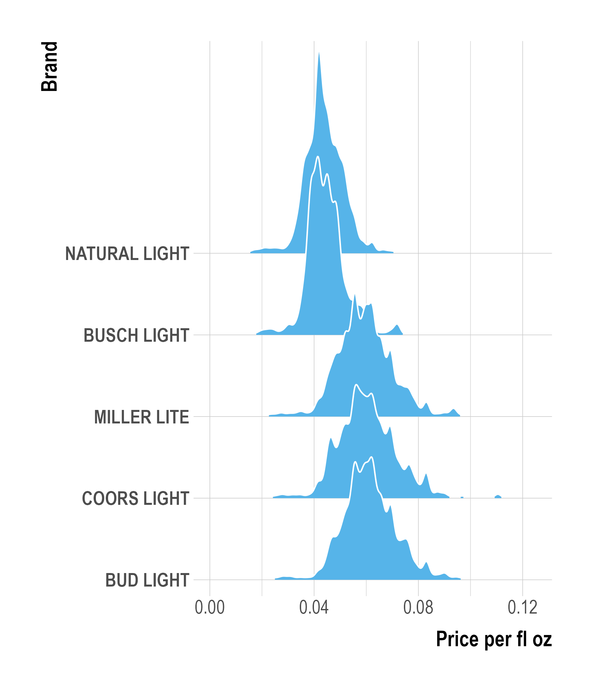
```

]

--

.pull-right[
```{r}
ggplot(beer_mkt, 
       aes(x = price_per_floz,
           y = brand)) + 
  geom_density_ridges(
    color = "white")
  ...
```

]


---
# Making Discoveries from Distribution Plots
### <p style="color:#00449E">  </p>


.pull-left[

```{r, echo=FALSE, eval = T, warning=F, message=F, out.width = '100%', fig.align='center'}
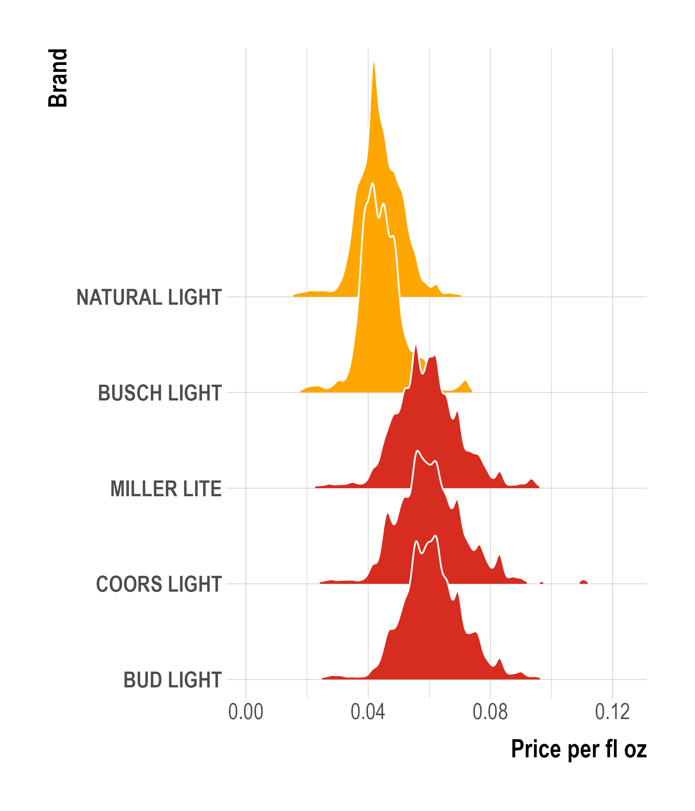
```

]


---
# Making Discoveries from Distribution Plots
### <p style="color:#00449E">  </p>


.pull-left[

```{r, echo=FALSE, eval = T, warning=F, message=F, out.width = '100%', fig.align='center'}

```

]


.pull-right[
```{r}
ggplot(beer_mkt, 
       aes(x = price_per_floz,
           y = brand,
*           fill = group)) + 
  geom_density_ridges(
    color = "white") + 
  ...
```

]


---
# Making Discoveries from Distribution Plots
### <p style="color:#00449E">  </p>


.pull-left[

```{r, echo=FALSE, eval = T, warning=F, message=F, out.width = '100%', fig.align='center'}

```

]


.pull-right[
```{r}
* # Adding the `group` variable
beer_mkt <- beer_mkt %>% 
*  mutate(group = 
            ifelse(
             brand %in% 
               c('BUD LIGHT',
                 'COORS LIGHT',
                 'MILLER LITE'), 
             TRUE, FALSE) )
ggplot(beer_mkt, 
       aes(x = price_per_floz,
           y = brand,
           fill = group)) + 
  geom_density_ridges(
    color = "white") + 
  ...
```

]


---
class: inverse, center, middle
# Beer Markets
### <p style="color:#00449E">  </p>

**Q**. Would consumers tend to buy the same brand of beer?

**Q**. If so, how much would it be different across beer brands?


---
# Making Discoveries from Distribution Plots

Here is how the `beer_mkt` data.frame looks like:

```{r, echo = F, eval = T, message=F, warning=F}
rmarkdown::paged_table(beer_mkt %>% 
                         select(hh, market, brand, beer_floz, price_per_floz, spent, promo, everything()) %>% arrange(hh, brand), options = list(rows.print = 5) )
```

--

We do not have the variable for **the fraction of beer brand choice made by households** yet.


---
class: inverse, center, middle
# Beer Markets
### <p style="color:#00449E">  </p>

**Q**. How can we transform the `beer_mkt` data.frame to address the questions?


---
# How can we transform data for visualization?
```{r}
* # Create a new data frame called 'loyal' 
# by piping the 'beer_mkt' data frame
# into the subsequent operations.
* loyal <- beer_mkt %>%  # A good way to pronounce %>% is “then”.

  # Create a new variable for each brand that takes on the value of 1 
  # if the 'brand' variable is equal to each brand's name, and 
  # 0 otherwise.
  mutate(bud = ifelse(brand=="BUD LIGHT", 1, 0),
         busch = ifelse(brand=="BUSCH LIGHT", 1, 0),
         coors = ifelse(brand=="COORS LIGHT", 1, 0),
         miller = ifelse(brand=="MILLER LITE", 1, 0),
         natural = ifelse(brand=="NATURAL LIGHT", 1, 0)
         ) %>% 
```


---
# How can we transform data for visualization?
```{r}
# Create a new data frame called 'loyal' 
# by piping the 'beer_mkt' data frame
# into the subsequent operations.
loyal <- beer_mkt %>%  # A good way to pronounce %>% is “then”.

*  # Create a new variable for each brand that takes on the value of 1 
*  # if the 'brand' variable is equal to each brand's name, and 
*  # 0 otherwise.
*   mutate(bud = ifelse(brand=="BUD LIGHT", 1, 0),
         busch = ifelse(brand=="BUSCH LIGHT", 1, 0),
         coors = ifelse(brand=="COORS LIGHT", 1, 0),
         miller = ifelse(brand=="MILLER LITE", 1, 0),
         natural = ifelse(brand=="NATURAL LIGHT", 1, 0)
         ) %>% 
```


---
# How can we transform data for visualization?
```{r}
*  # Group the data frame by the 'hh' variable.
*  group_by(hh) %>%
  
*  # Create new variables that calculate 
*  # the fraction of purchases 
*  # that are of each brand for each household.
*  mutate(frac_bud = sum(bud)/n(), # n(): total # of observations in each hh
         frac_busch = sum(busch)/n(),
         frac_coors = sum(coors)/n(),
         frac_miller = sum(miller)/n(),
         frac_natural = sum(natural)/n(),
         n_purchases = n()) %>%
         
```


---
# How can we transform data for visualization?
```{r}
*  # Select only the 'hh' variable 
*  # and variables that start with 'frac_'.
*  select(market, hh, n_purchases, starts_with("frac_")) %>%
  
  # Remove duplicate rows.
  distinct() %>%
  
  # Filter the data frame to only include households that made 2 
  # or more purchases.
  filter(n_purchases >= 2) %>%
  
  # Remove the 'market' and 'n_purchases' variables 
  #that we do not need anymore.
  select(-market, -n_purchases) 
```


---
# How can we transform data for visualization?
```{r}
  # Select only the 'hh' variable 
  # and variables that start with 'frac_'.
  select(market, hh, n_purchases, starts_with("frac_")) %>%
  
*  # Remove duplicate rows.
*  distinct() %>%
  
  # Filter the data frame to only include households that made 2 
  # or more purchases.
  filter(n_purchases >= 2) %>%
  
  # Remove the 'market' and 'n_purchases' variables 
  #that we do not need anymore.
  select(-market, -n_purchases) 
```


---
# How can we transform data for visualization?
```{r}
  # Select only the 'hh' variable 
  # and variables that start with 'frac_'.
  select(market, hh, n_purchases, starts_with("frac_")) %>%
  
  # Remove duplicate rows.
  distinct() %>%
  
*  # Filter the data frame to only include households that made 2 
*  # or more purchases.
*  filter(n_purchases >= 2) %>%
  
  # Remove the 'market' and 'n_purchases' variables 
  #that we do not need anymore.
  select(-market, -n_purchases) 
```

---
# How can we transform data for visualization?
```{r}
  # Select only the 'hh' variable 
  # and variables that start with 'frac_'.
  select(market, hh, n_purchases, starts_with("frac_")) %>%
  
  # Remove duplicate rows.
  distinct() %>%
  
  # Filter the data frame to only include households that made 2 
  # or more purchases.
  filter(n_purchases >= 2) %>%
  
*  # Remove the 'market' and 'n_purchases' variables 
*  #that we do not need anymore.
*  select(-market, -n_purchases) 
```


---
# How can we transform data for visualization?

Here is how the `loyal` data.frame looks like:

```{r, echo = F, eval = T, message=F, warning=F}
# Create a new variable called 'loyal' by piping the 'beer_mkt' data frame
# into the subsequent operations.
loyal <- beer_mkt %>%  # A good way to pronounce %>% is “then”.

  # Create a new variable for each brand that takes on the value of 1 
  # if the 'brand' variable in the 'beer_mkt' data frame is equal to each brand's name, and 0 otherwise.
  mutate(bud = ifelse(brand=="BUD LIGHT", 1, 0),
         busch = ifelse(brand=="BUSCH LIGHT", 1, 0),
         coors = ifelse(brand=="COORS LIGHT", 1, 0),
         miller = ifelse(brand=="MILLER LITE", 1, 0),
         natural = ifelse(brand=="NATURAL LIGHT", 1, 0)
         ) %>% 

    # Group the data frame by the 'hh' variable.
  group_by(hh) %>%
  
  # Create new variables that calculate the fraction of purchases 
  # that are of each brand for each household.
  mutate(frac_bud = sum(bud)/n(),
         frac_busch = sum(busch)/n(),
         frac_coors = sum(coors)/n(),
         frac_miller = sum(miller)/n(),
         frac_natural = sum(natural)/n(),
         n_purchases = n()) %>%
         
  # Remove the grouping that was previously applied to the data frame.
  ungroup() %>%

  # Select only the 'hh' variable and variables that start with 'frac_'.
  select(market, hh, n_purchases, starts_with("frac_")) %>%
  
  # Remove duplicate rows.
  distinct() %>%
  
  # Sort the data frame by the 'market' and 'hh' columns.
  arrange(market, hh) %>%
  
  # Filter the data frame to only include households that made 2 or more purchases.
  filter(n_purchases >= 2) %>%
  
  # Remove the 'market' and 'n_purchases' variables that we do not need anymore.
  select(-market, -n_purchases) 

rmarkdown::paged_table(loyal %>% arrange(hh) %>% 
                         mutate(frac_bud = round(frac_bud, 2),
                                frac_busch = round(frac_busch, 2),
                                frac_coors = round(frac_coors, 2),
                                frac_miller = round(frac_miller, 2),
                                frac_natural = round(frac_natural, 2))
                       , options = list(rows.print = 4) )
```

- A row represents a single household. 
- Each `frac_` column represents the fraction of each brand choice made by households. 


---
# Making Discoveries from Histograms

We can use the `loayl` data.frame to plot **histograms** of how the `frac` varies by `brand`.

--

.pull-left[

```{r}
p1 <- 
  ggplot(data = loyal, 
       aes(x = frac_bud) +
  geom_histogram()
  
p2 <- 
  ggplot(data = loyal, 
       aes(x = frac_busch) +
  geom_histogram()
  
  ...
  
```

]

.pull-left[

```{r}
p5 <- 
  ggplot(data = loyal, 
       aes(x = frac_natural) +
  geom_histogram()
  
```


]


---
# Making Discoveries from Histograms

We can use the `loayl` data.frame to plot **histograms** of how the `frac` varies by `brand`.

.pull-left[

```{r}
p1 <- 
  ggplot(data = loyal, 
       aes(x = frac_bud) +
  geom_histogram()
  
p2 <- 
  ggplot(data = loyal, 
       aes(x = frac_busch) +
  geom_histogram()
  
  ...
  
```

]

.pull-left[

```{r}
p5 <- 
  ggplot(data = loyal, 
       aes(x = frac_natural) +
  geom_histogram()
  
* # To combine the five ggplots 
* # into one
* grid.arrange(
  p1, p2, p3, p4, p5
)
```


]


---
# How can we transform data for visualization?

It is not convenient to use the `loyal` data.frame to visualize how `frac_` varies across `brands`.

We may better reshape the `loyal` data.frame for the visualization.

--

```{r}
# Reshape the data frame to a longer format.
loyal_long <- loyal %>% 
pivot_longer(cols = starts_with("frac"), #column names that include brand 
               # names of `frac_*` 
               # will go to the `brand` variable in the new data.frame
               names_to = "brand", 
               # values of `frac_*` 
               # will go to the `frac` variable in the new data.frame
               values_to = "frac") 
```


---
# How can we transform data for visualization?

It is not convenient to use the `loyal` data.frame to visualize how `frac_` varies across `brands`.

We may better reshape the `loyal` data.frame for the visualization.


```{r}
# Reshape the data frame to a longer format.
loyal_long <- loyal %>% 
*pivot_longer(cols = starts_with("frac"), #column names that include brand 
               # names of `frac_*` 
               # will go to the `brand` variable in the new data.frame
               names_to = "brand", 
               # values of `frac_*` 
               # will go to the `frac` variable in the new data.frame
               values_to = "frac") 
```


---
# How can we transform data for visualization?

It is not convenient to use the `loyal` data.frame to visualize how `frac_` varies across `brands`.

We may better reshape the `loyal` data.frame for the visualization.


```{r}
# Reshape the data frame to a longer format.
loyal_long <- loyal %>% 
pivot_longer(cols = starts_with("frac"), #column names that include brand
*               # names of `frac_*` 
*               # will go to the `brand` variable in the new data.frame
*               names_to = "brand", 
               # values of `frac_*` 
               # will go to the `frac` variable in the new data.frame
               values_to = "frac") 
```


---
# How can we transform data for visualization?

It is not convenient to use the `loyal` data.frame to visualize how `frac_` varies across `brands`.

We may better reshape the `loyal` data.frame for the visualization.


```{r}
# Reshape the data frame to a longer format.
loyal_long <- loyal %>% 
pivot_longer(cols = starts_with("frac"), #column names that include `brand` 
               # names of `frac_*` 
               # will go to the `brand` variable in the new data.frame
               names_to = "brand", 
*               # values of `frac_*` 
*               # will go to the `frac` variable in the new data.frame
*               values_to = "frac") 
```


---
# Beer Markets

Here is how the long-form data.frame, `loyal_long` looks like:

.pull-left[
```{r, echo = F, eval = T, message=F, warning=F}
loyal <- beer_mkt %>% 
  mutate(bud = ifelse(brand=="BUD LIGHT", 1, 0),
         busch = ifelse(brand=="BUSCH LIGHT", 1, 0),
         coors = ifelse(brand=="COORS LIGHT", 1, 0),
         miller = ifelse(brand=="MILLER LITE", 1, 0),
         natural = ifelse(brand=="NATURAL LIGHT", 1, 0) ) %>% 
  group_by(hh) %>% 
  mutate(frac_bud = sum(bud)/n(),
         frac_busch = sum(busch)/n(),
         frac_coors = sum(coors)/n(),
         frac_miller = sum(miller)/n(),
         frac_natural = sum(natural)/n(),
         n_purchases = n()) %>%
  ungroup() %>% 
  select(market, hh, n_purchases,
         starts_with("frac_")) %>% 
  distinct() %>% 
  arrange(market, hh) %>% 
  filter(n_purchases >= 2)

loyal_long <- loyal %>% 
  select(-market, -n_purchases) %>% 
  pivot_longer(cols = starts_with("frac"),
               names_to = "brand",
               values_to = "frac") %>% 
  # filter(frac != 0) %>%
  mutate(brand = str_replace(brand, "frac_", "")) %>% 
  mutate(brand = factor(brand,
                        levels =
                          c("bud", "coors", "miller", "busch", "natural"),
                        labels = c("BUD", "COORS",
                                   "MILLER", "BUSCH",
                                   "NATURAL")))

rmarkdown::paged_table(loyal_long %>% 
                         select(hh, brand, frac) %>% arrange(hh, brand) %>% mutate(frac = round(frac, 2))
                         , options = list(rows.print = 10) )
```
]

.pull-right[

- Each household have five rows for five differnt brands. 
- One `frac` column contains the fractions of each brand choice made by households. 

]

---
# Making Discoveries from Histograms

We can now use the *long-from* data.frame, `loyal_long`, to visualize how the distribution of `frac` varies by `brand`.

--

```{r}
ggplot(data = loyal_long, 
       aes(x = frac)) +
  geom_histogram() +
  ...
```


---
# Making Discoveries from Histograms

We can now use the *long-from* data.frame, `loyal_long`, to visualize how the distribution of `frac` varies by `brand`.

```{r}
ggplot(data = loyal_long, 
       aes(x = frac)) +
  geom_histogram() +
*  # to split the histogram into its subplots 
*  # based on the values of `brand` variable
*  facet_grid( . ~ brand)  
```

---
# Making Discoveries from Histograms
### <p style="color:#00449E">  </p>

```{r, echo=FALSE, eval = T, warning=F, message=F, out.width = '100%', fig.align='center', caption = 'US'}
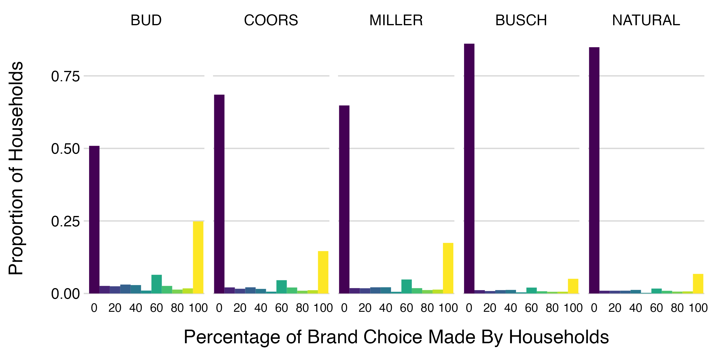
```


---
class: inverse, center, middle
# Beer Markets
### <p style="color:#00449E">  </p>

**Q**. How likely do beer consumers stick to only one beer brand, such as `BUD`?

---
# Making Discoveries from Histograms
### <p style="color:#00449E">  </p>

We can focus on households that purchased `BUD` at least once, and then see how often these households choose `BUD`.


--

```{r}
# Subsets the `loyal_long` data to only include rows 
# where the 'frac' variable is greater than 0
loyal_long2 <- loyal_long %>% 
  filter(frac > 0) 
```


---
# Making Discoveries from Histograms
### <p style="color:#00449E">  </p>

```{r, echo=FALSE, eval = T, warning=F, message=F, out.width = '100%', fig.align='center', caption = 'US'}
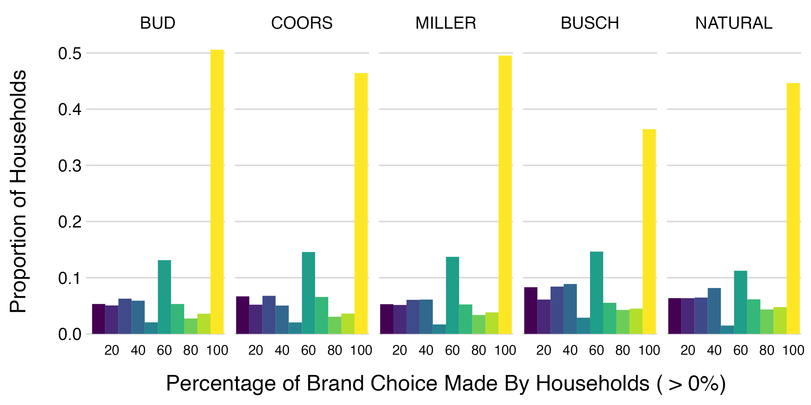
```


---
# Making Discoveries from Relationship Plots
### <p style="color:#00449E">  </p>

- From the **relationship** plots (e.g., scatter plots, box plots), we want to see **co-variation**, the tendency for the values of two or more variables to vary together in a **related** way. 

--

- What type of **co-variation** occurs between variables?
  - Are they positively associated?
  - Are they negatively associated?
  - Are there no association between them?


---
# Making Discoveries from Relationship Plots
### <p style="color:#00449E">  </p>

.pull-left[

```{r}
ggplot(beer_mkt,
       aes(x = beer_floz,
           y = price_per_floz)) +
  geom_point(aes(color = brand)) +
  ...
```

]

--

.pull-right[

```{r, echo=FALSE, eval = T, warning=F, message=F, out.width = '100%', fig.align='center'}
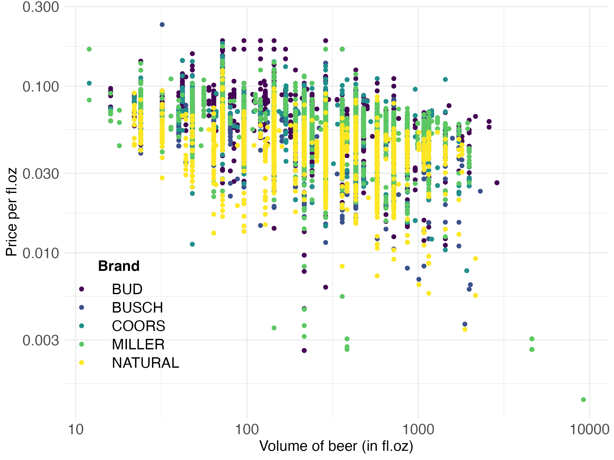
```

]


---
# Making Discoveries from Relationship Plots
### <p style="color:#00449E">  </p>

.pull-left[

```{r}
ggplot(beer_mkt,
       aes(x = beer_floz,
           y = price_per_floz)) +
  geom_point(aes(color = brand)) +
  ...
```

*Q*. Does this scatter plot show 73,115 data points?

]


.pull-right[

```{r, echo=FALSE, eval = T, warning=F, message=F, out.width = '100%', fig.align='center'}

```

]


---
# Making Discoveries from Relationship Plots
### <p style="color:#00449E">  </p>

.pull-left[

```{r}
ggplot(beer_mkt,
       aes(x = beer_floz,
           y = price_per_floz)) +
  geom_point(aes(color = brand)) +
  ...
```

*Q*. Does this scatter plot show 73,115 data points?
  - Most of them are over-plotted `r emoji('worried')`.
]


.pull-right[

```{r, echo=FALSE, eval = T, warning=F, message=F, out.width = '100%', fig.align='center'}

```

]


---
# Making Discoveries from Relationship Plots
### <p style="color:#00449E">  </p>

.pull-left[

```{r}
ggplot(beer_mkt,
       aes(x = beer_floz,
           y = price_per_floz) ) +
  geom_point(aes(color = brand),
*             alpha = .02) +
  ...
```

]


.pull-right[

```{r, echo=FALSE, eval = T, warning=F, message=F, out.width = '100%', fig.align='center'}
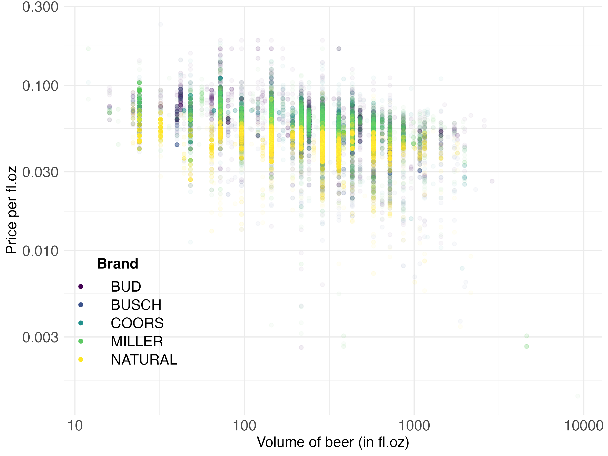
```


]


---
# Making Discoveries from Relationship Plots
### <p style="color:#00449E">  </p>

.pull-left[

```{r}
ggplot(beer_mkt,
       aes(x = beer_floz,
           y = price_per_floz) ) +
  geom_point(aes(color = brand),
*             alpha = .02) +
  ...
```

- It's still not clear to see how the relationship varies by brand `r emoji('worried')`.

]

.pull-right[

```{r, echo=FALSE, eval = T, warning=F, message=F, out.width = '100%', fig.align='center'}

```


]


---
# Making Discoveries from Relationship Plots
### <p style="color:#00449E">  </p>

.pull-left[

```{r}
ggplot(beer_mkt,
       aes(x = beer_floz,
           y = price_per_floz) ) +
  geom_point(aes(color = brand),
             alpha = .2) +
*  facet_wrap( brand ~ .) +
  ...
```


]


.pull-right[
```{r, echo=FALSE, eval = T, warning=F, message=F, out.width = '100%', fig.align='center'}
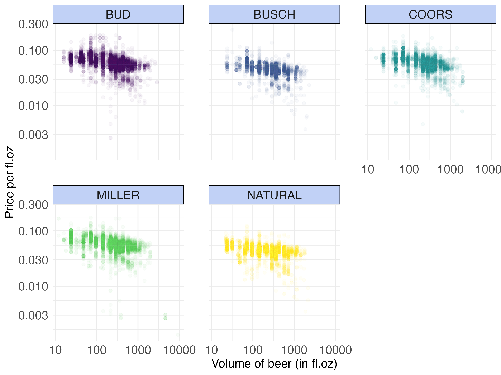
```

]


---
# Making Discoveries from Relationship Plots
### <p style="color:#00449E">  </p>

.pull-left[

```{r}
ggplot(beer_mkt,
       aes(x = beer_floz,
           y = price_per_floz) ) +
  geom_point(aes(color = brand),
             alpha = .2) +
*  facet_wrap( brand ~ .) +
  ...
```

- It's still not clear to see how the relationship varies by brand `r emoji('worried')`.


]


.pull-right[
```{r, echo=FALSE, eval = T, warning=F, message=F, out.width = '100%', fig.align='center'}

```

]


---
# Making Discoveries from Relationship Plots
### <p style="color:#00449E">  </p>


.pull-left[

```{r}
ggplot(beer_mkt,
       aes(x = beer_floz,
           y = price_per_floz) ) +
  geom_point(aes(color = brand),
             alpha = .2) +
*  geom_smooth(method = lm, 
              size = 1.5) +
  facet_wrap( brand ~ .) +
  ...
```

]


.pull-right[

```{r, echo=FALSE, eval = T, warning=F, message=F, out.width = '100%', fig.align='center'}

```

]

--

We see the **downward-sloping demand curves** in the beer market! `r emoji('wink')`


---
# Making Discoveries from Relationship Plots
### <p style="color:#00449E">  </p>


.pull-left[

```{r}
ggplot(beer_mkt,
       aes(x = beer_floz,
           y = price_per_floz) ) +
  geom_point(aes(color = brand),
             alpha = .2) +
*  geom_smooth(method = lm, 
              size = 1.5) +
  facet_wrap( brand ~ .) +
  ...
```

]


.pull-right[

```{r, echo=FALSE, eval = T, warning=F, message=F, out.width = '100%', fig.align='center'}
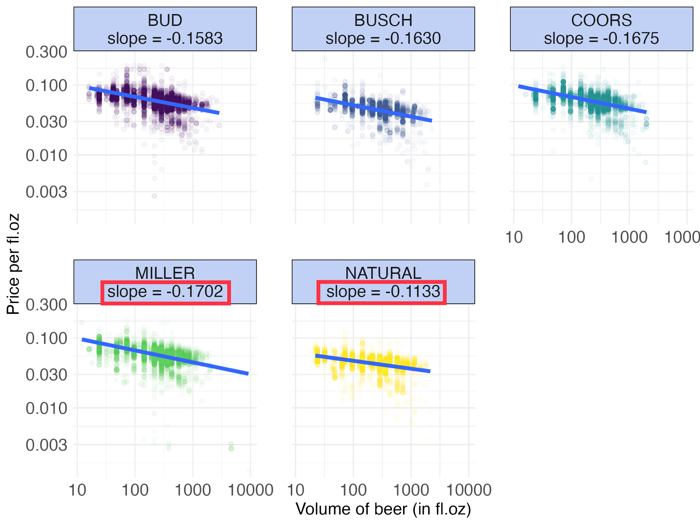
```

]


We see the downward-sloping demand curves in the beer market! `r emoji('wink')`


  - There might be differences in the **price elasticity of beer demand** across brands.  `r emoji('thinking')`


---
# Making Discoveries from Relationship Plots
### <p style="color:#00449E">  </p>

The `beer_mkt` data.frame also has socioeconomic variables, such as age, marital status, family status, employment, etc.


```{r, echo=FALSE, eval = T, warning=F, message=F, out.width = '67%', fig.align='center', caption = 'US'}

```


---
class: inverse, center, middle
# Beer Markets
### <p style="color:#00449E">  </p>

**Q**. Would there be any association between socioeconomic characteristics and beer demands?

---
# Making Discoveries from Heatmaps

.left-column[

```{r}
#
# US_cor:
# Correlation
# data.frame
ggcorrplot(
  US_cor, 
  lab = T )
```


]

.right-column[

```{r, echo=FALSE, eval = T, warning=F, message=F, out.width = '75%', fig.align='center', caption = 'US'}
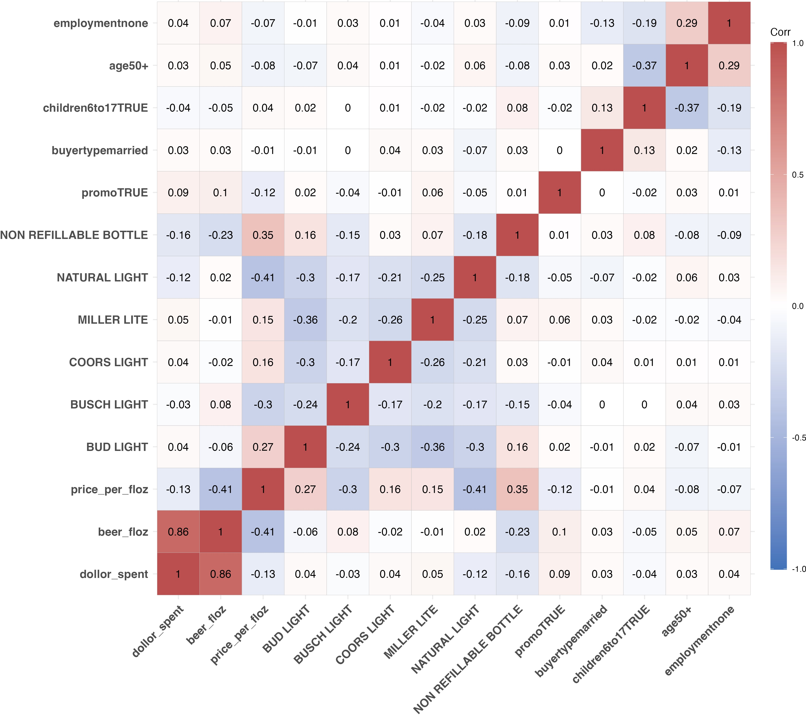
```


]


---
# Making Discoveries from Heatmaps

.left-column[

```{r}
# 
# NY_cor:
# Correlation
# data.frame
# for NY obs.
ggcorrplot(
  NY_cor,
  lab = T )
```


]

.right-column[

```{r, echo=FALSE, eval = T, warning=F, message=F, out.width = '75%', fig.align='center', caption = 'US'}
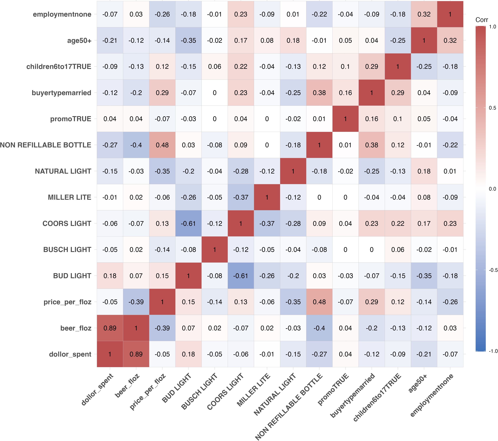
```


]


---
# Making Discoveries from Heatmaps


.left-column[

```{r}
# 
# NY_cor:
# Correlation
# data.frame
# for NY obs.
ggcorrplot(
  NY_cor,
  lab = T )
```

- The NY beer market might be different! `r emoji('wink')`.

]

.right-column[

```{r, echo=FALSE, eval = T, warning=F, message=F, out.width = '75%', fig.align='center', caption = 'US'}

```


]


---
class: inverse, center, middle
# Beer Markets
### <p style="color:#00449E">  </p>

**Q**. How are market shares of each beer brand across regional markets in the US?


---
# Making Discoveries from Maps

We have geographic information about **designated-market areas** (DMA).

DMA-level US maps make it easy to present a geographical distribution to explain how regional markets behave differently in the US.

--

<!-- Let's make an interactive US beer map! -->

```{r}
ggplot(data = beer_mkt,
       aes( geometry = geometry )) + # mapping for the spatial geometry
  geom_sf( data = DMA_sf ) +  # additional map data
  geom_sf_interactive(  # Adds an interactive layer 
  # with tooltips and fill colors
  # Sets the fill color based on brand variable
    aes(fill = brand, 
        # Sets the tooltip to display both market and pct variables 
        tooltip = interaction(market, pct), 
        data_id = market 
        )
    ) + ...
```


---
# Making Discoveries from Maps


We have geographic information about **designated-market areas** (DMA).

DMA-level US maps make it easy to present a geographical distribution to explain how regional markets behave differently in the US.


<!-- Let's make an interactive US beer map! -->

```{r}
ggplot(data = beer_mkt,
       aes( geometry = geometry )) + # mapping for the spatial geometry
  geom_sf( data = DMA_sf ) +  # additional map data
* geom_sf_interactive(  # Adds an interactive layer 
  # with tooltips and fill colors
  # Sets the fill color based on brand variable
    aes(fill = brand, 
        # Sets the tooltip to display both market and pct variables 
        tooltip = interaction(market, pct), 
        data_id = market 
        )
    ) + ...
```


---
# Making Discoveries from Maps

```{r, echo=F, eval = T}
knitr::include_url('beer_map2.html', height = "500px")
```


---
# Making Discoveries from Maps
### <p style="color:#00449E">  </p>

```{r, echo=F, eval = T}
knitr::include_url('beer_map_ny2.html', height = "500px")
```


---
class: inverse, center, middle


> *"I will let the data speak for itself when it cleans itself."
– Allison Reichel*

<html><div style='float:left'></div><hr color='#EB811B' size=1px width=796px></html>


---
# TGIF! Go and grab a beer. Enjoy yourself!

```{r, echo=FALSE, eval = T, out.width = '100%', fig.align='center'}

```

