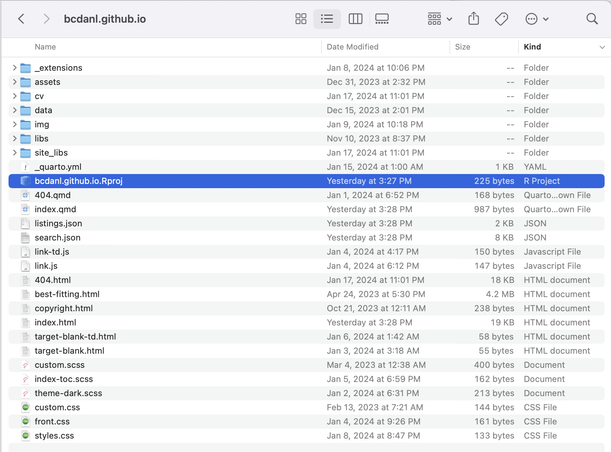

```{r setup}
#| include: false
#| eval: true

library(knitr)
library(tidyverse)
# set default options
opts_chunk$set(echo = FALSE,
               fig.width = 7.252,
               fig.height = 4,
               comment = "#",
               dpi = 300)

knitr::knit_engines$set("markdown")
```


# Instructor {background-color="#1c4982"}

## Instructor
### Current Appointment & Education

- Name: Byeong-Hak Choe.
- Assistant Professor of Data Analytics and Economics, School of Business at SUNY Geneseo.


- Ph.D. in Economics from University of Wyoming.
- M.S. in Economics from Arizona State University.
- M.A. in Economics from SUNY Stony Brook.
- B.A. in Economics & B.S. in Applied Mathematics from Hanyang University at Ansan, South Korea.
  - Minor in Business Administration.
  - Concentration in Finance.
  


## Instructor
### Economics, Data Science, and Climate Change

- Choe, B.H., 2021. "Social Media Campaigns, Lobbying and Legislation: Evidence from #climatechange and Energy Lobbies."

- Question: To what extent do social media campaigns compete with fossil fuel lobbying on climate change legislation?

- Data include:
  - 5.0 million tweets with #climatechange/#globalwarming around the globe;
  - 12.0 million retweets/likes to those tweets;
  - 0.8 million Twitter users who wrote those tweets;
  - 1.4 million Twitter users who retweeted or liked those tweets;
  - 0.3 million US Twitter users with their location at a city level;
  - Firm-level lobbying data (expenses, targeted bills, etc.). 


## Instructor
### Economics, Data Science, and Climate Change

- Choe, B.H. and Ore-Monago, T., 2024. "Governance and Climate Finance in the Developing World"

- **Climate finance** refers to the financial resources allocated for mitigating and adapting to climate change, including support for initiatives that reduce greenhouse gas emissions and enhance resilience to climate impacts.
  - We focus on transnational financing that rich countries provide poor countries with financial resources, in order to help them adapt to climate change and mitigate greenhouse gas (GHG) emissions.
  - Since the GHG emissions in developing countries are rapidly growing, it is crucial to assess the effectiveness of climate finance.
  - Poor governance can be significant barriers to emissions reductions within these countries.


## Instructor
### Economics, Data Science, and Climate Change

- Choe, B.H. and Ore-Monago, T., 2024. "Governance and Climate Finance in the Developing World"

- Data include:
  - Global climate finance data (e.g., donors, recipients, characteristics of climate change projects)
  - World Bank Governance Indicators over the years (e.g., government effectiveness, voice and accountability, political stability and absence of violence/terrorism, regulatory quality, rule of law, control of corruption)
  - Various economic indicators (e.g., trade pattern of low carbon technology products, macroeconomic risks, energy)


# Syllabus {background-color="#1c4982"}

## Syllabus

### Email, Class & Office Hours

- Email: [bchoe@geneseo.edu](bchoe@geneseo.edu)


- Class Homepage: 
  i. [https://brightspace.geneseo.edu/](https://brightspace.geneseo.edu/){target="_blank"}
  i. [http://bcdanl.github.io/210/](http://bcdanl.github.io/210/){target="_blank"}
  
  
- Office: South Hall 301
- Office Hours: 
  - To be determined.


## Syllabus

### Course Description

- This course is designed to provide a comprehensive overview of data handling techniques, focusing on practical application through case studies. 

- Key topics include: 
  1. data loading, cleaning, transformation, merging, and reshaping;
  2. techniques for slicing, dicing, and summarizing datasets;
  3. data collection via web scraping and APIs. 
  
- These areas will be explored through detailed, real-world examples to address common data analysis challenges. 

- Throughout the course, students will gain hands-on experience with **Python** and its data analysis libraries, along with practical applications of **git** and **GitHub**.


## Syllabus
### Required Materials

- [**Python for Data Analysis** (3rd Edition)](https://wesmckinney.com/book){target="_blank"} by [Wes McKinney](https://wesmckinney.com/){target="_blank"}

  - A free online version of this book is available.


## Syllabus
### Reference Materials

- [Guide for Quarto](https://quarto.org/docs/guide){target="_blank"}

- [Python Programming for Data Science](https://www.tomasbeuzen.com/python-programming-for-data-science){target="_blank"} by Tomas Beuzen

- [Coding for Economists](https://aeturrell.github.io/coding-for-economists){target="_blank"} by Arthur Turrell 

- [Python for Econometrics in Economics](https://pyecon.org/lecture/}{https://pyecon.org/lecture/){target="_blank"} by Fabian H. C. Raters

- [QuantEcon DataScience - Python Fundamentals](https://datascience.quantecon.org/python_fundamentals/index.html){target="_blank"} by Chase Coleman, Spencer Lyon, and Jesse Perla

- [QuantEcon DataScience - pandas](https://datascience.quantecon.org/pandas/index.html){target="_blank"} by Chase Coleman, Spencer Lyon, and Jesse Perla


## Syllabus
### Course Requirements


- **Laptop**: You should bring your own laptop (**Mac** or **Windows**) to the classroom. 
  - It is recommended to have 2+ core CPU, 4+ GB RAM, and 500+ GB disk storage in your laptop for this course.
  
::: {.incremental}

- **Homework**: There will be six homework assignments.

- **Team Project**: There will be one team project on a *personal website*.

- **Exams**: There will be one Midterm Exam and one final exam. 
  - The final exam is comprehensive.

- **Discussions**: You are encouraged to participate in GitHub-based online discussions for each lecture, classwork, and homework.
  - Checkout the netiquette policy in the syllabus.

:::


<!-- ## Syllabus -->
<!-- ### Netiquette Policy for Online Discussions -->

<!-- - Before posting your question to a discussion board, check if anyone has asked it already and received a reply. Just as you would not repeat a topic of discussion right after it happened in real life, do not do that in discussion boards either. -->
<!-- - Stay on topic - Do not post irrelevant inks. comments, thoughts, or pictures. -->
<!-- - Do not type in all capital letters. If you do, it will look like you are screaming. -->
<!-- - Do not write anything that sounds angry or sarcastic, even as a joke, because without hearing your tone of voice, your peers might not realize you are joking. -->
<!-- - Always remember to say "Please" and "Thank you" when soliciting help from your peers or an instructor. -->
<!-- - Respect the opinions of your classmates. If you feel the need to disagree, do so respectfully and acknowledge the valid points in your peers' arguments. Acknowledge that others are entitled to have their own perspective on the issue. -->
<!-- - If you reply to a question from a peer, make sure your answer is accurate! If you are not 100% when the homework is due, do not guess. Otherwise, you could really mess things up for your peers and they will not appreciate it. -->
<!-- - Be brief. If you write a long dissertation in response to a simple question, it is unlikely that anyone will spend the time to read through it all. -->
<!-- - If you ask a question and many people respond, summarize all answers and post that summary to benefit your whole class. -->
<!-- - Do not badmouth others or call them stupid. You may disagree with their ideas, but do not mock the person. -->
<!-- - If you refer to something your peers said earlier in the discussion, quote just a few key lines from their post so that others wont have to go back and figure out which post you re referring to. -->
<!-- - Be forgiving. If your peer makes a mistake, do not badger him or her for it. Just let it go - it happens to the best of us. -->
<!-- - Run a spelling and grammar check before posting anything to the discussion board. It only takes a minute, and can make the difference between sounding like a fool and sounding knowledgeable. -->


## Syllabus

### Personal Website

- You will create your own website using Quarto, R Studio, and Git. 

- You will publish your homework assignments and team project on your website. 

- Your website will be hosted in [GitHub](https://www.github.com){target="_blank"}. 

- The basics in Markdown will be discussed.

- References:
  - [Quarto Guide](https://quarto.org/docs/guide){target="_blank"}


## Syllabus
### Team Project

- Team formation is scheduled for late March. 

::: {.incremental}

- Each team must have three to five students. 

- For the team project, a team must choose data related to business or socioeconomic issues. 

- The project report should include exploratory data analysis using summary statistics, visual representations, and data wrangling. 

- The document for the team project must be published in each member's website. 

- Any changes to team composition require approval from Byeong-Hak Choe. 

::: 


## Syllabus

### Class Schedule and Exams

- There will be tentatively 27 lecture sessions.

::: {.incremental}

- The Midterm Exam is scheduled on March 7, 2024, Thursday, during the class time.

- The Final Exam is scheduled on May 10, 2024, Tuesday, 3:30 P.M.--5:30 P.M.

- No class on 
  - February 27, Tuesday (*Diversity Summit*)
  - March 12, Tuesday and March 14, Thursday (*Spring Break*)

- The due for the team project is scheduled on May 16, 2024, Thursday.

:::


## Syllabus
### Course Contents

- The first half of the course covers R basics and data visualization:
```{r, out.width='100%', fig.align='center'}
#| eval: true
#| echo: false
text_tbl <- data.frame(
  Week = c("1", "2", "3", "4", "5", "6", "7"),
  Contents = c("Course Outlines; Installing the Tools; Building a Website",
"Python Basics with Google Colab",
"pandas Basics",
"Filtering, Sorting, and Ranking DataFrames",
"Visualizing DataFrames and Group Operations",
"Group Operations",
"Group Operations"),
  `HW Exam` = c("", "HW 1", "", "HW 2", "", "HW 3", "Midterm")
  )


# Create a DT datatable without search box and 'Show entries' dropdown
DT::datatable(text_tbl, rownames = FALSE,
              options = list(
  dom = 't', # This sets the DOM layout without the search box ('f') and 'Show entries' dropdown ('l')
  paging = FALSE, # Disable pagination
  columnDefs = list(list(
    targets = "_all", # Applies to all columns
    orderable = FALSE # Disables sorting
  ))
), callback = htmlwidgets::JS("
  // Change header background and text color
  $('thead th').css('background-color', '#1c4982');
  $('thead th').css('color', 'white');

  // Loop through each row and alternate background color
  $('tbody tr').each(function(index) {
    if (index % 2 == 0) {
      $(this).css('background-color', '#d1dae6'); // Light color for even rows
    } else {
      $(this).css('background-color', '#9fb2cb'); // Dark color for odd rows
    }
  });

  // Set text color for all rows
  $('tbody tr').css('color', 'black');

  // Add hover effect
  $('tbody tr').hover(
    function() {
      $(this).css('background-color', '#607fa7'); // Color when mouse hovers over a row
    }, 
    function() {
      var index = $(this).index();
      if (index % 2 == 0) {
        $(this).css('background-color', '#d1dae6'); // Restore even row color
      } else {
        $(this).css('background-color', '#9fb2cb'); // Restore odd row color
      }
    }
  );
")
)

```


## Syllabus
### Course Contents

- The second half of the course covers data wrangling:
```{r, out.width='100%', fig.align='center'}
#| eval: true
#| echo: false
text_tbl <- data.frame(
  Week = c("8", "9", "10", "11-13", "14-15"),
  Contents = c(
"Reshaping and Pivoting DataFrames",
"Merging, Joining, and Concatenating DataFrames",
"Missing Data and Time-series Data",
"Web Scrapping with BeautifulSoup and Selenium",
"Data Collection with Application Programming Interfaces (APIs) "
),
  `HW Exam` = c("", "", "HW 4", "HW 5", "HW 6")
  )


# Create a DT datatable without search box and 'Show entries' dropdown
DT::datatable(text_tbl, rownames = FALSE,
              options = list(
  dom = 't', # This sets the DOM layout without the search box ('f') and 'Show entries' dropdown ('l')
  paging = FALSE, # Disable pagination
  columnDefs = list(list(
    targets = "_all", # Applies to all columns
    orderable = FALSE # Disables sorting
  ))
), callback = htmlwidgets::JS("
  // Change header background and text color
  $('thead th').css('background-color', '#1c4982');
  $('thead th').css('color', 'white');

  // Loop through each row and alternate background color
  $('tbody tr').each(function(index) {
    if (index % 2 == 0) {
      $(this).css('background-color', '#d1dae6'); // Light color for even rows
    } else {
      $(this).css('background-color', '#9fb2cb'); // Dark color for odd rows
    }
  });

  // Set text color for all rows
  $('tbody tr').css('color', 'black');

  // Add hover effect
  $('tbody tr').hover(
    function() {
      $(this).css('background-color', '#607fa7'); // Color when mouse hovers over a row
    }, 
    function() {
      var index = $(this).index();
      if (index % 2 == 0) {
        $(this).css('background-color', '#d1dae6'); // Restore even row color
      } else {
        $(this).css('background-color', '#9fb2cb'); // Restore odd row color
      }
    }
  );
")
)

```


## Syllabus
### Grading

$$
\begin{align}
(\text{Total Percentage Grade}) =&\quad\;\, 0.05\times(\text{Total Attendance Score})\notag\\
&\,+\, 0.05\times(\text{Discussion Score})\notag\\ 
&\,+\, 0.05\times(\text{Website Score})\notag\\ 
&\,+\, 0.15\times(\text{Team Project and Website Score})\notag\\ 
&\,+\, 0.20\times(\text{Total Homework Score})\notag\\ 
&\,+\, 0.50\times(\text{Total Exam Score}).\notag
\end{align}
$$


## Syllabus
### Grading

- You are allowed up to 5 absences without penalty. 
  - Send me an email if you have standard excused reasons (illness, family emergency, transportation problems, etc.).


::: {.incremental}

- For each absence beyond the initial five, there will be a deduction of 1% from the Total Percentage Grade.

- Participation in discussions will be evaluated by quantity and quality of discussions in the GitHub-based discussion boards. 

- The single lowest homework score will be dropped when calculating the total homework score. 
  - Each homework except for the homework with the lowest score accounts for 20% of the total homework score.

::: 
  

## Syllabus
### Grading


- The total exam score is the maximum between 
  1. the simple average of the midterm exam score and the final exam score and
  2. the weighted average of them with one-fourth weight on the midterm exam score and three-third weight on the final exam score:

$$
\begin{align}
&(\text{Total Exam Score}) \\
=\, &\text{max}\,\left\{0.50\times(\text{Midterm Exam Score}) \,+\, 0.50\times(\text{Final Exam Score})\right.,\notag\\ 
&\qquad\;\,\left.0.25\times(\text{Midterm Exam Score}) \,+\, 0.75\times(\text{Final Exam Score})\right\}.\notag
\end{align}
$$


## Syllabus
### Make-up Policy

-  Make-up exams will not be given unless you have either a medically verified excuse or an absence excused by the University.

::: {.incremental}

- If you cannot take exams because of religious obligations, notify me by email at least two weeks in advance so that an alternative exam time may be set.

- A missed exam without an excused absence earns a grade of zero.

- Late submissions for homework assignment will be accepted with a penalty. 

- A zero will be recorded for a missed assignment.

:::


## Syllabus
### Academic Integrity and Plagiarism

-  All homework assignments and exams must be the original work by you. 

- Examples of academic dishonesty include:
  - *representing the work, thoughts, and ideas of another person as your own*
  - *allowing others to represent your work, thoughts, or ideas as theirs*, and
  - *being complicit in academic dishonesty by suspecting or knowing of it and not taking action*.


- Geneseo’s Library offers frequent workshops to help you understand how to **paraphrase**, **quote**, and **cite** outside sources properly. 
  - See [https://www.geneseo.edu/library/library-workshops](https://www.geneseo.edu/library/library-workshops){target="_blank"}.


## Syllabus
### Accessibility

-  The Office of Accessibility will coordinate reasonable accommodations for persons with physical, emotional, or cognitive disabilities to ensure equal access to academic programs, activities, and services at Geneseo.

- Please contact me and the Office of Accessibility Services for questions related to access and accommodations.


## Syllabus
### Well-being

- You are strongly encouraged to communicate your needs to faculty and staff and seek support if you are experiencing unmanageable stress or are having difficulties with daily functioning.

- Liz Felski, the School of Business Student Advocate ([felski@geneseo.edu](felski@geneseo.edu), South Hall 303), or the Dean of Students (585-245-5706) can assist and provide direction to appropriate campus resources.

- For more information, see [https://www.geneseo.edu/dean_students](https://www.geneseo.edu/dean_students){target="_blank"}.


## Syllabus
### Career Design

- To get information about career development, you can visit the Career Development Events Calendar ([https://www.geneseo.edu/career_development/events/calendar](https://www.geneseo.edu/career_development/events/calendar){target="_blank"}).

- You can stop by South 112 to get assistance in completing your Handshake Profile [https://app.joinhandshake.com/login](https://app.joinhandshake.com/login){target="_blank"}.
  - Handshake is ranked #1 by students as the best place to find full-time jobs.
  - 50% of the 2018-2020 graduates received a job or internship offer on Handshake.
  - Handshake is trusted by all 500 of the Fortune 500.


# Prologue {background-color="#1c4982"}


## Why Data Analytics?

::: {.incremental}

- Fill in the gaps left by traditional business and economics classes.
  - Practical skills that will benefit your future career.
  - Neglected skills like how to actually find datasets in the wild and clean them.

- Data analytics skills are largely distinct from (and complementary to) the core quantitative works familiar to business undergrads.
  - Data visualization, cleaning and wrangling; databases; machine learning; etc.

- In short, we will cover things that I wish someone had taught me when I was undergraduate.

:::

## You, at the end of this course

<p align="center">
  
</p>


## Why Data Analytics?

- **Data analysts** use analytical tools and techniques to extract meaningful insights from data.
  - Skills in data analytics are also useful for **business analysts** or **market analysts**.


- [Breau of Labor Statistics](https://www.bls.gov/ooh/math/data-scientists.htm){target="_blank"} forecasts that the projected growth rate of the employment in the industry related to data analytics from 2021 to 2031 is **36%**. 
  - The average growth rate for all occupations is **5%**.


## Why Personal Website?
### Benefits of a Personal Website in Data Analytics

:::{}
- Here are the example websites:
  - [Byeong-Hak's Website](https://bcecon.github.io){target="_blank"}
  - [DANL Website Template](https://bcdanl.github.io/danl-website-template){target="_blank"}
:::

:::{.incremental}
- **Professional Showcase**: Display skills and projects
- **Visibility and Networking**: Increase online presence
- **Controlled Narrative**: Manage your professional brand
- **Content Sharing and Engagement**: Publish articles, insights
- **Job Opportunities**: Attract potential employers and clients
- **Long-term Asset**: A growing repository of your career journey
- **Reproducible Research**: Showcase data-driven reports
:::


## Why Python, R, and Databases?


## Why Python, R, and Databases?

- [Stack Overflow](https://stackoverflow.com){target="_blank"}  is the most popular Q & A website specifically for programmers and software developers in the world.

- See how programming languages have trended over time based on use of their tags in Stack Overflow from 2008 to 2022.


:::: {.columns}

::: {.column width="50%"}
### Most Popular Languagues


:::


::: {.column width="50%"}
### Data Science and Big Data


:::

:::: 


## The State of the Art
### Generative AI and ChatGPT


:::: {.columns }

::: {.column width="50%"}
### Data Science and Big Data Trend

From 2008 to 2023
 


:::


::: {.column width="50%"}

### Programmers in 2024


:::


::::


## The State of the Art
### Generative AI and ChatGPT

- **Generative AI** refers to a category of artificial intelligence (AI) that is capable of generating new content, ranging from text, images, and videos to music and code. 

:::{.incremental}

- In the early 2020s, advances in transformer-based deep neural networks enabled a number of generative AI systems notable for accepting natural language prompts as input.
  - These include large language model (LLM) chatbots such as ChatGPT, Copilot, Bard, and LLaMA.

- **ChatGPT** (Chat Generative Pre-trained Transformer) is a chatbot developed by OpenAI and launched on November 30, 2022. 
  - By January 2023, it had become what was then the fastest-growing consumer software application in history.

:::


## The State of the Art
### Generative AI and ChatGPT

  
- Users around the world have explored how to best utilize GPT for writing essays and programming codes.


::::{.incremental}

:::{}
- Is AI a threat to data analytics?
  - Fundamental understanding of the subject matter is still crucial for effectively utilizing AI's capabilities.
:::

:::{}
- If you use Generative AI such as ChatGPT, please try to understand what ChatGPT gives you.
  - Copying and pasting it without any understanding harms your learning opportunity.
:::

::::


# Today's Learning Objectives {background-color="#1c4982"}

## Learning Objectives
:::{}
- Understand the concept of the tools we will use throughout the course:
  - Git
  - GitHub
  - Python
  - Google Colab
  - R
  - RStudio
  - R Packages

:::

:::{}
- Set up the tools in your laptop.
  - Anaconda
  - R, RStudio, and R Packages
  - Git
  - If possible, your personal website
  
:::


# DANL Tools {background-color="#1c4982"}


## What is Git?

:::: {.columns}

::: {.column width="45%"}

:::

::: {.column width="55%"}

$\quad$

- **Git** is the most popular **version control** tool for any software development.
  - It tracks changes in a series of snapshots of the project, allowing developers to revert to previous versions, compare changes, and merge different versions. 
  - It is the industry standard and ubiquitous for coding collaboration.
  
:::

::::

## What is Git?

:::: {.columns}

::: {.column width="40%"}


:::

::: {.column width="60%"}

```{.bash}
git add .
git commit -m "any message is here"
git push -u origin main
```

$\quad$


::: {.incremental}
- Git operates primarily through command-line tools (e.g., **Terminal**) and is local to a user's computer.

  - It has a steep learning curve.

  
- We will not do *git collaboration* but use only the 3-step git commands on Terminal to update a website.

:::
:::

:::: 


## What is GitHub?

- [GitHub](https://github.com/){target="_blank"} is a web-based hosting platform for Git repositories to store, manage, and share code. 

::: {.incremental}

- Your personal website will be hosted on a GitHub repository.

- Course contents will be posted not only in Brightspace but also in our GitHub repositories ("repos") and websites.

- Github is useful for many reasons, but the main reason is how user friendly it makes uploading and sharing code.

:::


## What is Python?

:::{.incremental}
- Python is an interpreted, object-oriented, high-level programming language with dynamic semantics.
  - It supports multiple programming paradigms, including procedural, object-oriented, and functional programming. 
  - Its extensive standard library and the vast ecosystem of third-party packages make it suitable for a wide range of applications, from web development and data analysis to artificial intelligence and scientific computing.
:::


## What is Google Colab?
- [https://colab.research.google.com/](https://colab.research.google.com/){target="_blank"} is analogous to Google Drive, but specifically for writing and executing Python code in your browser.
  - The base Colab link listed above leads to a Python notebook introducing Colab and how to use it.

- This video also helps get started with Colab if you are unfamiliar with the format!
  - [https://www.youtube.com/watch?v=inN8seMm7UI](https://www.youtube.com/watch?v=inN8seMm7UI){target="_blank"}


## Why use Colab?
:::{.incremental}
- A key benefit of Colab is that it is entirely free to use and has many of the standard Python modules pre installed. 
  - It allows for CPU or GPU usage, even for free users, and stores the files in Google’s servers so you can access your files from anywhere you can connect to the Internet.
  
- Using Colab also means you can entirely avoid the process of installing Python and any dependencies onto your computer.

- Colab notebooks don’t just contain Python code. They can contain text, images, and HTML!

- Ultimately, they're intuitive to use and let you jump right into the code and data analysis without needing to worry about the more cumbersome details needed to run Python notebooks on a personal computer.
:::


## What is Anaconda?
:::{.incremental}

- **Anaconda** is an all-in-one Python distribution.
  - Anaconda includes Python 3.x and its standard libraries such as `pip`, `pandas`, `matplotlib`, etc.
  - Anaconda also includes several software applications of integrated development environment (IDE).
  - An IDE is a software application that provides comprehensive facilities (e.g., text code editor, graphical user interface (GUI)) to computer programmers for software development. 

- For our course, we will mainly use **Google Colab**. 
  - If we need to use Python locally from your laptop, we can use **Jupyter** or **Spyder** IDE from Anaconda Distribution.

- If you know how to set up [Visual Studio Code (**VS Code**)](https://code.visualstudio.com){target="_blank"}, go for it!
  - VS Code is a free, open-source code editor developed by Microsoft, and is widely used by developers for programming and software development.

:::

## What is R?

- **R** is a programming language and software environment designed for statistical computing and graphics. 

- R has become a major tool in data analysis, statistical modeling, and visualization. 
  - It is widely used among statisticians and data scientists for developing statistical software and performing data analysis. 
  - R is open source and freely available. 


## What is RStudio?

:::{.incremental}
- **RStudio** is an integrated development environment (IDE) mainly for R. 

- RStudio is a user-friendly interface that makes using R easier and more interactive. 
  - It provides a console, syntax-highlighting editor that supports direct code execution, as well as tools for plotting, history, debugging, and workspace management.
  - It integrates well with Git. 
  
:::


## Python vs. R

:::: {.incremental}
:::: {.columns}

::: {.column width="50%"}

### Python

- Python can be used for a wide range of applications, from web and game development to machine learning, making it a highly versatile language.

- Python has the largest community in the programming world, providing a wealth of resources, libraries, and frameworks. 

:::

::: {.column width="50%"}
### R
- R is particularly strong in statistical analysis and visualization, with a vast number of packages for statistical methods, including machine learning.

- The community around R, particularly in academia and research, is very active.


:::

::::

- Both Python and R hold significant value in industry and government sectors. 
  - However, Python is often more favored for roles in the industry, whereas R tends to be preferred for positions in the public sector.


::::


# Installing the Tools {background-color="#1c4982"}

## Installing the Tools
### Getting a GitHub account

:::: {.incremental}

::: {}
- Create the GitHub account with your Geneseo email.
  1. Go to [GitHub](https://github.com){target="_blank"}.
  2. Click "Sign up for GitHub".
:::

::: {}
- Choose your GitHub username carefully:
  - `https://YOUR_GITHUB_USERNAME.github.io` will be the address for your website.
  - Byeong-Hak's GitHub username is `bcdanl`, so that Byeong-Hak owns the web address `https://bcdanl.github.io`.
:::

::: {}
- It is better to have a username with *all lower cases*.
:::

::::

## Installing the Tools
### Anaconda

- To install Anaconda, go to the following download page:
  - [https://www.anaconda.com/products/distribution](https://www.anaconda.com/products/distribution){target="_blank"}.
  - Click the "Download" button.


## Installing the Tools
### R programming

- The R language is available as a free download from the R Project website at:
  - Windows: [https://cran.r-project.org/bin/windows/base/](https://cran.r-project.org/bin/windows/base/){target="_blank"}
  - Mac: [https://cran.r-project.org/bin/macosx/](https://cran.r-project.org/bin/macosx/){target="_blank"}
  - Download the file of R that corresponds to your Mac OS (Big Sur, Apple silicon arm64, High Sierra, El Capitan, Mavericks, etc.)


## Installing the Tools
### R Studio

:::{}
- The RStudio Desktop is available as a free download from the following webpage:
    - [https://www.rstudio.com/products/rstudio/download/#download](https://www.rstudio.com/products/rstudio/download/#download){target="_blank"}
:::

:::: {.columns}

::: {.column width="50%"}
- For **Mac** users, try the following steps:
  1. Run **`RStudio-*.dmg`** file.
  2. From the Pop-up menu, click the RStudio icon.
  3. While clicking the RStudio icon, drag it to the **Applications** directory.

:::

::: {.column width="50%"}

:::
::::


## Installing the Tools
### RStudio Environment
:::: {.columns}
::: {.column width="50%"}

:::

::: {.column width="50%"}


- **Script Pane** is where you write R commands in a script file that you can save.

:::{.incremental}
  - An R script is simply a text file containing R commands. 
  - RStudio will color-code different elements of your code to make it easier to read.

:::

:::
::::


:::: {.columns}

::: {.column width="50%"}
:::{.incremental}
- To open an R script, 
  - File $>$ New File  $>$ R Script

:::
:::

::: {.column width="50%"}
:::{.incremental}
- To save the R script, 
  - File $>$ Save

:::
:::

::::

## Installing the Tools
### RStudio Environment
:::: {.columns}
::: {.column width="50%"}

:::

::: {.column width="50%"}
- **Console Pane** allows you to interact directly with the R interpreter and type commands where R will immediately execute them.
:::
::::

## Installing the Tools
### RStudio Environment
:::: {.columns}
::: {.column width="50%"}

:::

::: {.column width="50%"}
- **Environment Pane** is where you can see the values of variables, data frames, and other objects that are currently stored in memory.

- Type below in the Console Pane, and then hit *Enter*:
```{.r}
a <- 1
```

:::
::::

## Installing the Tools
### RStudio Environment

:::: {.columns}
::: {.column width="50%"}

:::

::: {.column width="50%"}
- **Plots Pane** contains any graphics that you generate from your R code.

:::
::::


## Installing the Tools
### R Packages and `tidyverse`

- **R packages** are collections of R functions, compiled code, and data that are combined in a structured format.


:::{.incremental}

- The `tidyverse` is a collection of R packages designed for data science that share an underlying design philosophy, grammar, and data structures. 
  - The `tidyverse` packages work harmoniously together to make data manipulation, exploration, and visualization more.
  - We will use several R packages from `tidyverse` throughout the course. (e.g., `ggplot2`, `dplyr`, `tidyr`)

:::


## Installing the Tools
### Installing R packages with `install.packages("packageName")`

- R packages can be easily installed from within R using functions  `install.packages("packageName")`. 
  - To install the R package `tidyverse`, type and run the following from R console:

:::{.incremental}
```{.r}
install.packages("tidyverse")
```


- While running the above codes, you may encounter the question below from the R Console:


:::: {.columns}
::: {.column width="50%"}

- **Mac**: *"Do you want to install from sources the packages which need compilation?"* from Console Pane.
:::

::: {.column width="50%"}

- **Windows**: *"Would you like to use a personal library instead?"* from Pop-up message.
:::
::::

- Type `no` in the R Console, and then hit *Enter*.

:::

## Installing the Tools
### Loading R packages with `library(packageName)`

- Once installed, a package is loaded into an R session using `library(packageName)` so that its functions and data can be used.
  - To load the R package `tidyverse`, type and run the following command from a R script:

```{.r}
library(tidyverse)
df_mpg <- mpg
```

:::{.incremental}
- `mpg` is the data.frame provided by the R package `ggplot2`, one of the R pakcages in `tidyverse`.
:::

## Installing the Tools
### RStudio Options Setting

:::: {.columns}
::: {.column width="50%"}

:::

::: {.column width="50%"}
- This option menu is found by menus as follows:
  - Tools $>$ Global Options

- Check the boxes as in the left.
- Choose the option __*Never*__ for <u> Save workspace to .RData on exit: </u>
:::

::::


## Installing the Tools
###  Git

- From the Consol Pane in RStudio, click Terminal.

- In the Terminal, run the following command to check if your laptop has `git` installed.


```{.bash}
git --version
```


## Installing the Tools
### Install `git` if you do not have it.


::::{.columns}


::: {.column width="50%"}

#### Mac
  - Go to [http://git-scm.com/downloads](http://git-scm.com/downloads){target="_blank"}, and download the file.
  - Run the downloaded file.

:::

::: {.column width="50%"}

#### Windows
  - Go to [https://gitforwindows.org](https://gitforwindows.org){target="_blank"}, and download the file.
  - Run the downloaded file.

:::
::::

- Keep clicking "Next" to complete installation of `git`.

- After the `git` installation is done, close RStudio and re-open it.


## Installing the Tools
###  Establishing GitHub Credential on your local Git.

Step 0. In Terminal, run the following commands one by one:
```{.bash}
git config --global user.email "YOUR_GITHUB_EMAIL_ADDRESS"
git config --global user.name "YOUR_GITHUB_USERNAME"
```


## Installing the Tools
###  Establishing GitHub Credential on your local Git.

Step 1. Obtain a personal access token (PAT) for GitHub. 

  - In RStudio Console, run the followings line by line:
```{r, echo = T, eval = F}
install.packages("usethis")
usethis::create_github_token()
```
  - Then, click “Generate token” in the pop-upped web browser. 
  - Then, copy the generated PAT to your clipboard or R script.


## Installing the Tools
###  Establishing GitHub Credential on your local Git.


Step 2. Set the GitHub credential using the PAT. 

  - In RStudio **Console**, run the followings line by line:
```{r, echo = T, eval = F}
install.packages("gitcreds")
gitcreds::gitcreds_set()
```
  - Then, paste your PAT to the RStudio Console
  
  

## Installing the Tools
###  Establishing the connection between GitHub repo and your local laptop

Step 3. Login to your GitHib and make the repository.

  - From [https://github.com](https://github.com){target="_blank"}, click the plus (+) icon in the upper right corner and select "New repository".

  - Name this repo `YOUR_GITHUB_NAME.github.io`, which will be the domain for your website.

  - Then, copy the web address of your GitHub repo.


## Installing the Tools
###  Establishing the connection between GitHub repo and your local laptop


Step 4. Create a RStudio project with Version Control

  1. Click "Project (None)" at the top-right corner in RStudio.
  
  2. Click "New Project" > "Version Control" > "Git"
  
  3. Paste the web address of your GitHub repo to the Repository URL menu.
  
  4. Click "Browse" to select the parent directory for your local project directory (I recommend "Documents" folder.)
  
  5. Click "Create"


## Installing the Tools
###  Establishing the connection between GitHub repo and your local laptop

- For users who can't create the R project with version control, do the following alternative Steps 4-1 and 4-2:

Step 4-1. Use `git clone` to establish the connection between GitHub repo and your local laptop
  1. Change the directory to "Documents" in Terminal.

:::: {.columns}

::: {.column width="50%"}
```{.bash}
cd /Users/USERNAME/Documents
```
:::

::: {.column width="50%"}
```{.bash}
cd C:\Users\USERNAME\Documents
```

:::
::::

  2. Use `git clone` to creates a local copy of the GitHub Repository.
```{.bash}
git clone <repository-url>
```

- For example,

```{.bash}
git clone https://github.com/YOUR_USERNAME/YOUR_USERNAME.github.io
```


## Installing the Tools
###  Establishing the connection between GitHub repo and your local laptop

- For users who can't create the R project with version control, do the following alternative Steps 4-1 and 4-2:

Step 4-2. Create a RStudio project from Existing Directory

  1. Click "Project (None)" at the top-right corner in RStudio.
  
  2. Click "New Project" > "Existing Directory" 
  
  3. Click "Browse" to select a local copy of the GitHub Repository
  
  4. Click "Create Project"


## Installing the Tools
### Website Template Files

Step 5. Download the files of website template:

  1. Go to the following webpage: 
  [https://github.com/bcdanl/danl-website-template](https://github.com/bcdanl/danl-website-template){target="_blank"}
  2. From the webpage above, click the green icon “< > Code”, and then click “Download ZIP”

  3. Extract the ZIP file you have downloaded
  
  4. If there are the files, `.gitignore`, `.DS_Store`, or `*.Rproj`, in the folder, delete them.

  5. Move all the files that were compressed the ZIP file to your local project directory.
  - **Ctrl/cmd + A** selects all files in a folder.


## Installing the Tools
### Website Template Files

- All the website files should be located at the same level with the R Project file (`YOUR_USERNAME.github.io.Rproj`).

<p align="center" >
  
</p>


## Installing the Tools
### Pushing the website files to the GitHub repository

Step 6. Push the files to your GitHub repository

  - On Terminal within RStudio, execute the following three git commands, which will stage, commit, and push all the files to your GitHub repository:

```{.bash}
git add .
git commit -m “ANY_MASSAGE”
git push -u origin main
```

If `git push -u origin main` gives error, try the following:
```{.bash}
git push -u origin master
```


## Installing the Tools
### Pushing the website files to the GitHub repository

Step 7. Check whether the files are well uploaded

- Go to the webpages of your GitHub repository and your website:
  - [https://github.com/YOUR_USERNAME/YOUR_USERNAME.github.io.git](https://github.com/YOUR_USERNAME/YOUR_USERNAME.github.io.git){target="_blank"}
  - [https://YOUR_USERNAME.github.io](https://YOUR_USERNAME.github.io){target="_blank"}
  - Refresh the webpage (**cmd/Ctrl + R**)


<script>
document.addEventListener('wheel', function(event) {
    if (event.deltaY > 0) {
        Reveal.next(); // Scroll down to go to the next slide
    } else {
        Reveal.prev(); // Scroll up to go to the previous slide
    }
}, false);

window.onload = function() {
    document.querySelectorAll('a').forEach(function(link) {
        link.setAttribute('target', '_blank');
    });
};
</script>